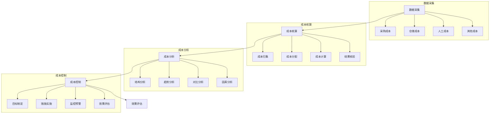

# 库存成本系统设计

> 远哥说：库存成本管理是企业降本增效的关键环节，通过科学的成本核算和控制方法，实现库存成本的精细化管理和持续优化。

## 一、系统概述

### 1.1 系统定位
```
功能定位：
1. 业务目标
   - 精确核算成本
   - 控制库存成本
   - 优化成本结构
   - 提升经济效益

2. 系统价值
   - 成本透明
   - 精细管理
   - 成本控制
   - 决策支持

3. 用户角色
   - 财务主管：成本管控
   - 成本会计：核算分析
   - 仓储员：数据录入
   - 管理层：决策支持
```

### 1.2 核心功能
| 模块 | 功能点 | 业务价值 | 实现难点 |
|------|--------|----------|----------|
| 成本核算 | 精确计算 | 成本透明 | 核算准确 |
| 成本分析 | 多维分析 | 问题诊断 | 分析方法 |
| 成本控制 | 预警管理 | 成本优化 | 控制措施 |
| 决策支持 | 方案建议 | 科学决策 | 模型构建 |

### 1.3 核心业务流程



## 二、功能设计

### 2.1 成本核算
```
功能模块：
1. 数据采集
   - 采购成本
   - 仓储成本
   - 人工成本
   - 其他成本

2. 成本计算
   - 成本归集
   - 成本分配
   - 成本计算
   - 结果核验

3. 成本分析
   - 结构分析
   - 趋势分析
   - 对比分析
   - 因素分析

4. 报表管理
   - 报表生成
   - 报表审核
   - 报表发布
   - 报表归档
```

### 2.2 成本控制
```
功能模块：
1. 目标管理
   - 目标制定
   - 目标分解
   - 目标下达
   - 目标跟踪

2. 预警管理
   - 规则设置
   - 监控预警
   - 异常处理
   - 效果评估

3. 措施管理
   - 方案制定
   - 措施实施
   - 效果跟踪
   - 持续优化

4. 评估管理
   - 数据采集
   - 指标计算
   - 效果分析
   - 改进建议
```

## 三、流程设计

### 3.1 业务流程
```
流程步骤：
1. 数据采集
   - 数据收集
   - 数据验证
   - 数据处理
   - 数据存储

2. 成本核算
   - 成本归集
   - 成本分配
   - 成本计算
   - 结果核验

3. 成本控制
   - 目标制定
   - 措施实施
   - 监控预警
   - 效果评估

4. 决策支持
   - 数据分析
   - 方案建议
   - 决策支持
   - 效果跟踪
```

### 3.2 管理流程
| 阶段 | 工作内容 | 负责人 | 输出物 |
|------|----------|--------|--------|
| 采集阶段 | 数据采集 | 仓储员 | 原始数据 |
| 核算阶段 | 成本核算 | 成本会计 | 核算报告 |
| 控制阶段 | 成本控制 | 财务主管 | 控制方案 |
| 评估阶段 | 效果评估 | 分析员 | 评估报告 |

## 四、系统实现

### 4.1 技术架构
```
系统架构：
1. 前端技术
   - Web端：Vue.js
   - 移动端：Flutter
   - 图表：ECharts
   - UI框架：Element UI

2. 后端技术
   - 开发语言：Java
   - 框架：Spring Boot
   - 数据库：MySQL
   - 缓存：Redis

3. 算法模型
   - 核算算法
   - 分析算法
   - 预警算法
   - 预测算法

4. 部署架构
   - 容器化：Docker
   - 编排：Kubernetes
   - 网关：Nginx
   - 监控：Prometheus
```

### 4.2 数据模型
| 实体 | 属性 | 关系 | 说明 |
|------|------|------|------|
| 成本 | 成本信息 | 1:n | 主体 |
| 核算 | 核算信息 | n:1 | 从属 |
| 控制 | 控制信息 | n:1 | 从属 |
| 评估 | 评估信息 | n:1 | 从属 |

## 五、运营策略

### 5.1 成本策略
```
策略方向：
1. 核算策略
   - 精确核算
   - 及时核算
   - 全面核算
   - 动态核算

2. 控制策略
   - 目标控制
   - 过程控制
   - 预警控制
   - 持续控制

3. 优化策略
   - 结构优化
   - 流程优化
   - 方法优化
   - 持续改进

4. 管理策略
   - 制度完善
   - 流程规范
   - 责任明确
   - 考核激励
```

### 5.2 优化方向
| 方向 | 措施 | 目标 | 效果 |
|------|------|------|------|
| 核算优化 | 精确核算 | 成本透明 | 管理精细 |
| 控制优化 | 有效控制 | 成本降低 | 效益提升 |
| 分析优化 | 深入分析 | 问题明确 | 决策科学 |
| 管理优化 | 制度完善 | 规范管理 | 持续改进 |
