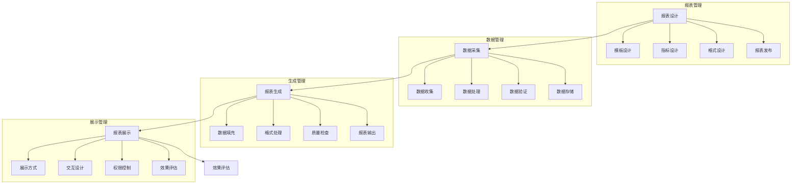

# 库存报表系统设计

> 远哥说：库存报表是库存管理的重要工具，通过科学的报表体系和直观的展示方式，实现库存状态的清晰呈现和管理决策的有效支持。

## 一、系统概述

### 1.1 系统定位
```
功能定位：
1. 业务目标
   - 清晰展示数据
   - 直观呈现状态
   - 支持管理决策
   - 优化运营效率

2. 系统价值
   - 状态透明
   - 问题可视
   - 决策支持
   - 效率提升

3. 用户角色
   - 报表主管：制定方案
   - 报表员：生成报表
   - 决策层：决策支持
   - 管理层：监督评估
```

### 1.2 核心功能
| 模块 | 功能点 | 业务价值 | 实现难点 |
|------|--------|----------|----------|
| 报表管理 | 报表制定 | 规范管理 | 体系设计 |
| 数据管理 | 数据采集 | 数据基础 | 数据质量 |
| 生成管理 | 报表生成 | 状态呈现 | 生成效率 |
| 展示管理 | 报表展示 | 直观可视 | 展示方式 |

### 1.3 核心业务流程



## 二、功能设计

### 2.1 报表管理
```
功能模块：
1. 模板管理
   - 模板设计
   - 模板维护
   - 模板发布
   - 模板归档

2. 指标管理
   - 指标设计
   - 指标计算
   - 指标验证
   - 指标维护

3. 格式管理
   - 格式设计
   - 样式定义
   - 布局优化
   - 格式验证

4. 维护管理
   - 报表更新
   - 报表优化
   - 报表停用
   - 报表归档
```

### 2.2 生成管理
```
功能模块：
1. 数据处理
   - 数据收集
   - 数据清洗
   - 数据计算
   - 数据验证

2. 报表生成
   - 数据填充
   - 格式处理
   - 质量检查
   - 报表输出

3. 展示管理
   - 展示方式
   - 交互设计
   - 权限控制
   - 效果评估

4. 分发管理
   - 报表分发
   - 权限控制
   - 阅读追踪
   - 反馈收集
```

## 三、流程设计

### 3.1 业务流程
```
流程步骤：
1. 报表设计
   - 模板设计
   - 指标设计
   - 格式设计
   - 报表发布

2. 数据采集
   - 数据收集
   - 数据处理
   - 数据验证
   - 数据存储

3. 报表生成
   - 数据填充
   - 格式处理
   - 质量检查
   - 报表输出

4. 报表展示
   - 展示方式
   - 交互设计
   - 权限控制
   - 效果评估
```

### 3.2 管理流程
| 阶段 | 工作内容 | 负责人 | 输出物 |
|------|----------|--------|--------|
| 设计阶段 | 报表设计 | 报表主管 | 报表方案 |
| 采集阶段 | 数据采集 | 数据员 | 数据集 |
| 生成阶段 | 报表生成 | 报表员 | 报表文件 |
| 展示阶段 | 报表展示 | 展示员 | 展示效果 |

## 四、系统实现

### 4.1 技术架构
```
系统架构：
1. 前端技术
   - Web端：React
   - 移动端：Flutter
   - 图表：Highcharts
   - UI框架：Ant Design

2. 后端技术
   - 开发语言：Java
   - 框架：Spring Boot
   - 数据库：MySQL
   - 缓存：Redis

3. 算法模型
   - 计算算法
   - 分析算法
   - 展示算法
   - 评估算法

4. 部署架构
   - 容器化：Docker
   - 编排：Kubernetes
   - 网关：Nginx
   - 监控：Prometheus
```

### 4.2 数据模型
| 实体 | 属性 | 关系 | 说明 |
|------|------|------|------|
| 报表 | 报表信息 | 1:n | 主体 |
| 数据 | 数据信息 | n:1 | 从属 |
| 生成 | 生成信息 | n:1 | 从属 |
| 展示 | 展示信息 | n:1 | 从属 |

## 五、运营策略

### 5.1 报表策略
```
策略方向：
1. 设计策略
   - 科学设计
   - 规范设计
   - 优化设计
   - 持续改进

2. 生成策略
   - 及时生成
   - 准确生成
   - 高效生成
   - 智能生成

3. 展示策略
   - 直观展示
   - 交互展示
   - 个性展示
   - 智能展示

4. 优化策略
   - 体系优化
   - 流程优化
   - 效率优化
   - 持续改进
```

### 5.2 优化方向
| 方向 | 措施 | 目标 | 效果 |
|------|------|------|------|
| 设计优化 | 体系完善 | 科学规范 | 基础夯实 |
| 生成优化 | 效率提升 | 及时准确 | 成本降低 |
| 展示优化 | 方式改进 | 直观可用 | 体验提升 |
| 管理优化 | 制度完善 | 规范管理 | 持续改进 |
