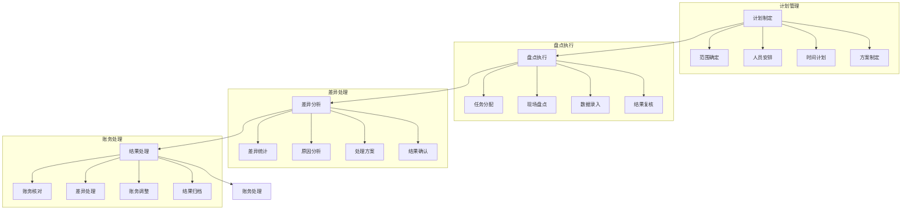

# 库存盘点系统设计

> 远哥说：库存盘点是确保库存准确性和资产安全的重要手段，通过科学的盘点方法和严格的管理制度，实现库存资产的有效管控。

## 一、系统概述

### 1.1 系统定位
```
功能定位：
1. 业务目标
   - 保证库存准确
   - 控制资产损失
   - 提升管理效率
   - 规范作业流程

2. 系统价值
   - 准确盘点
   - 高效作业
   - 损耗控制
   - 规范管理

3. 用户角色
   - 盘点主管：制定计划
   - 盘点员：执行盘点
   - 复核员：结果复核
   - 财务：账务处理
```

### 1.2 核心功能
| 模块 | 功能点 | 业务价值 | 实现难点 |
|------|--------|----------|----------|
| 计划管理 | 计划制定 | 科学盘点 | 计划合理 |
| 盘点执行 | 任务管理 | 准确盘点 | 效率保证 |
| 差异处理 | 差异分析 | 损耗控制 | 原因分析 |
| 账务处理 | 结果处理 | 账实相符 | 流程规范 |

### 1.3 核心业务流程



## 二、功能设计

### 2.1 计划管理
```
功能模块：
1. 计划制定
   - 范围确定
   - 时间安排
   - 人员分配
   - 方案设计

2. 任务管理
   - 任务分配
   - 进度跟踪
   - 异常处理
   - 结果确认

3. 资源管理
   - 人员管理
   - 设备管理
   - 工具管理
   - 场地管理

4. 方案管理
   - 方案制定
   - 方案审核
   - 方案发布
   - 方案优化
```

### 2.2 盘点执行
```
功能模块：
1. 现场盘点
   - 任务接收
   - 现场盘点
   - 数据录入
   - 结果提交

2. 数据管理
   - 数据采集
   - 数据验证
   - 数据汇总
   - 数据分析

3. 差异处理
   - 差异统计
   - 原因分析
   - 处理方案
   - 结果确认

4. 结果管理
   - 结果复核
   - 结果确认
   - 结果归档
   - 报告生成
```

## 三、流程设计

### 3.1 业务流程
```
流程步骤：
1. 计划制定
   - 范围确定
   - 方案设计
   - 资源配置
   - 计划发布

2. 盘点执行
   - 任务分配
   - 现场盘点
   - 数据录入
   - 结果复核

3. 差异处理
   - 差异统计
   - 原因分析
   - 方案制定
   - 结果确认

4. 账务处理
   - 账务核对
   - 差异处理
   - 账务调整
   - 结果归档
```

### 3.2 管理流程
| 阶段 | 工作内容 | 负责人 | 输出物 |
|------|----------|--------|--------|
| 计划阶段 | 计划制定 | 盘点主管 | 盘点计划 |
| 执行阶段 | 盘点执行 | 盘点员 | 盘点单 |
| 处理阶段 | 差异处理 | 复核员 | 处理单 |
| 账务阶段 | 账务处理 | 财务 | 账务单 |

## 四、系统实现

### 4.1 技术架构
```
系统架构：
1. 前端技术
   - Web端：Vue.js
   - 移动端：Flutter
   - 扫描：条码/RFID
   - UI框架：Element UI

2. 后端技术
   - 开发语言：Java
   - 框架：Spring Boot
   - 数据库：PostgreSQL
   - 缓存：Redis

3. 算法模型
   - 统计算法
   - 分析算法
   - 预警算法
   - 评估算法

4. 部署架构
   - 容器化：Docker
   - 编排：Kubernetes
   - 网关：Kong
   - 监控：Grafana
```

### 4.2 数据模型
| 实体 | 属性 | 关系 | 说明 |
|------|------|------|------|
| 计划 | 计划信息 | 1:n | 主体 |
| 盘点 | 盘点信息 | n:1 | 从属 |
| 差异 | 差异信息 | n:1 | 从属 |
| 账务 | 账务信息 | n:1 | 从属 |

## 五、运营策略

### 5.1 盘点策略
```
策略方向：
1. 计划策略
   - 周期盘点
   - 动态盘点
   - 全面盘点
   - 抽样盘点

2. 执行策略
   - 标准作业
   - 双人复核
   - 异常处理
   - 质量控制

3. 处理策略
   - 及时处理
   - 分级处理
   - 追责处理
   - 预防处理

4. 改进策略
   - 问题分析
   - 方案优化
   - 流程改进
   - 制度完善
```

### 5.2 优化方向
| 方向 | 措施 | 目标 | 效果 |
|------|------|------|------|
| 计划优化 | 科学计划 | 合理安排 | 效率提升 |
| 执行优化 | 标准作业 | 准确盘点 | 质量保证 |
| 处理优化 | 及时处理 | 损耗控制 | 成本降低 |
| 管理优化 | 制度完善 | 规范管理 | 体系健全 |
