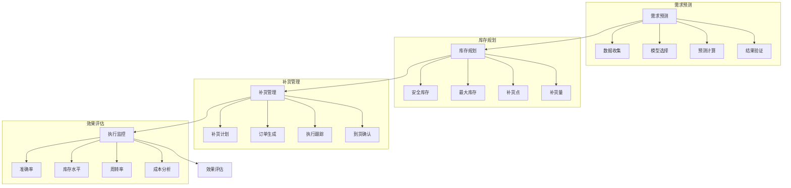

# 库存规划系统设计

> 远哥说：库存规划是供应链管理中的重要环节，通过科学的规划方法和预测模型，实现库存水平的最优化，既要确保供应的连续性，又要控制库存成本。

## 一、系统概述

### 1.1 系统定位
```
功能定位：
1. 业务目标
   - 优化库存水平
   - 降低库存成本
   - 保障供应连续
   - 提升周转效率

2. 系统价值
   - 科学预测
   - 精准规划
   - 成本控制
   - 效率提升

3. 用户角色
   - 规划主管：制定策略
   - 规划员：执行规划
   - 采购员：执行采购
   - 仓储员：库存管理
```

### 1.2 核心功能
| 模块 | 功能点 | 业务价值 | 实现难点 |
|------|--------|----------|----------|
| 需求预测 | 销量预测 | 科学预测 | 预测准确性 |
| 库存规划 | 水平优化 | 成本最优 | 平衡策略 |
| 补货管理 | 自动补货 | 及时供应 | 时效保障 |
| 绩效评估 | 效果评估 | 持续改进 | 指标体系 |

### 1.3 核心业务流程



## 二、功能设计

### 2.1 需求预测
```
功能模块：
1. 数据管理
   - 历史数据
   - 市场数据
   - 促销数据
   - 其他数据

2. 预测模型
   - 时间序列
   - 回归分析
   - 机器学习
   - 组合预测

3. 预测执行
   - 参数设置
   - 模型运算
   - 结果验证
   - 预测发布

4. 预测评估
   - 准确率
   - 偏差分析
   - 异常诊断
   - 模型优化
```

### 2.2 库存规划
```
功能模块：
1. 策略制定
   - 库存策略
   - 补货策略
   - 安全策略
   - 成本策略

2. 参数设置
   - 安全库存
   - 最大库存
   - 补货点
   - 补货量

3. 计划执行
   - 计划生成
   - 计划审核
   - 计划发布
   - 计划调整

4. 监控评估
   - 执行监控
   - 偏差分析
   - 效果评估
   - 持续优化
```

## 三、流程设计

### 3.1 业务流程
```
流程步骤：
1. 需求预测
   - 数据准备
   - 模型选择
   - 预测计算
   - 结果验证

2. 库存规划
   - 策略制定
   - 参数设置
   - 计划生成
   - 计划发布

3. 补货管理
   - 补货触发
   - 订单生成
   - 执行跟踪
   - 到货确认

4. 效果评估
   - 数据采集
   - 指标计算
   - 效果分析
   - 优化改进
```

### 3.2 管理流程
| 阶段 | 工作内容 | 负责人 | 输出物 |
|------|----------|--------|--------|
| 预测阶段 | 需求预测 | 规划员 | 预测报告 |
| 规划阶段 | 库存规划 | 规划员 | 规划方案 |
| 执行阶段 | 补货管理 | 采购员 | 补货单 |
| 评估阶段 | 效果评估 | 分析员 | 评估报告 |

## 四、系统实现

### 4.1 技术架构
```
系统架构：
1. 前端技术
   - Web端：Vue.js
   - 移动端：Flutter
   - 图表：ECharts
   - UI框架：Element UI

2. 后端技术
   - 开发语言：Python
   - 框架：FastAPI
   - 数据库：TimescaleDB
   - 消息队列：Kafka

3. 算法模型
   - 预测算法
   - 优化算法
   - 分析算法
   - 评估算法

4. 部署架构
   - 容器化：Docker
   - 编排：Kubernetes
   - 网关：Nginx
   - 监控：Prometheus
```

### 4.2 数据模型
| 实体 | 属性 | 关系 | 说明 |
|------|------|------|------|
| 预测 | 预测信息 | 1:n | 主体 |
| 规划 | 规划信息 | n:1 | 从属 |
| 补货 | 补货信息 | n:1 | 从属 |
| 评估 | 评估信息 | n:1 | 从属 |

## 五、运营策略

### 5.1 规划策略
```
策略方向：
1. 预测策略
   - 模型选择
   - 参数优化
   - 结果验证
   - 持续改进

2. 库存策略
   - 分类管理
   - 水平优化
   - 成本控制
   - 效率提升

3. 补货策略
   - 自动补货
   - 智能补货
   - 动态补货
   - 应急补货

4. 评估策略
   - 全面评估
   - 及时反馈
   - 持续优化
   - 经验总结
```

### 5.2 优化方向
| 方向 | 措施 | 目标 | 效果 |
|------|------|------|------|
| 预测优化 | 模型优化 | 准确预测 | 误差降低 |
| 库存优化 | 水平优化 | 成本最低 | 效益提升 |
| 补货优化 | 智能补货 | 及时供应 | 缺货减少 |
| 效率优化 | 流程优化 | 效率最高 | 周转提升 |
