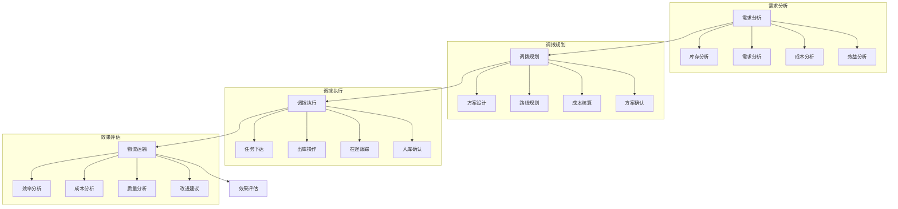

# 库存调拨系统设计

> 远哥说：库存调拨是优化库存分布、提升库存利用率的重要手段，通过科学的调拨策略和高效的执行机制，实现库存资源的合理配置。

## 一、系统概述

### 1.1 系统定位
```
功能定位：
1. 业务目标
   - 优化库存分布
   - 提升资源利用
   - 降低调拨成本
   - 保障供应效率

2. 系统价值
   - 智能调拨
   - 资源优化
   - 成本控制
   - 效率提升

3. 用户角色
   - 调拨主管：制定策略
   - 调拨员：执行调拨
   - 仓管员：库存管理
   - 物流员：运输执行
```

### 1.2 核心功能
| 模块 | 功能点 | 业务价值 | 实现难点 |
|------|--------|----------|----------|
| 调拨规划 | 方案设计 | 科学调拨 | 策略优化 |
| 调拨执行 | 任务管理 | 高效执行 | 协同配合 |
| 物流管理 | 运输管理 | 成本控制 | 时效保障 |
| 绩效评估 | 效果评估 | 持续改进 | 指标体系 |

### 1.3 核心业务流程



## 二、功能设计

### 2.1 调拨规划
```
功能模块：
1. 需求分析
   - 库存分析
   - 需求分析
   - 成本分析
   - 效益分析

2. 方案设计
   - 调拨策略
   - 路线规划
   - 时间安排
   - 资源配置

3. 成本核算
   - 运输成本
   - 人工成本
   - 仓储成本
   - 其他成本

4. 方案确认
   - 方案审核
   - 方案优化
   - 方案确认
   - 方案发布
```

### 2.2 调拨执行
```
功能模块：
1. 任务管理
   - 任务分配
   - 任务跟踪
   - 异常处理
   - 任务确认

2. 出入库管理
   - 出库准备
   - 出库操作
   - 入库检查
   - 入库确认

3. 物流管理
   - 运力调配
   - 在途跟踪
   - 异常处理
   - 签收确认

4. 单据管理
   - 单据生成
   - 单据审核
   - 单据跟踪
   - 单据归档
```

## 三、流程设计

### 3.1 业务流程
```
流程步骤：
1. 需求分析
   - 数据采集
   - 需求分析
   - 成本分析
   - 效益评估

2. 调拨规划
   - 方案设计
   - 路线规划
   - 成本核算
   - 方案确认

3. 调拨执行
   - 任务下达
   - 出库操作
   - 物流运输
   - 入库确认

4. 效果评估
   - 数据采集
   - 指标计算
   - 效果分析
   - 改进建议
```

### 3.2 管理流程
| 阶段 | 工作内容 | 负责人 | 输出物 |
|------|----------|--------|--------|
| 规划阶段 | 调拨规划 | 调拨主管 | 调拨方案 |
| 执行阶段 | 调拨执行 | 调拨员 | 调拨单 |
| 运输阶段 | 物流运输 | 物流员 | 运输单 |
| 评估阶段 | 效果评估 | 分析员 | 评估报告 |

## 四、系统实现

### 4.1 技术架构
```
系统架构：
1. 前端技术
   - Web端：React
   - 移动端：React Native
   - 地图：高德地图
   - UI框架：Ant Design

2. 后端技术
   - 开发语言：Java
   - 框架：Spring Cloud
   - 数据库：MySQL
   - 消息队列：RabbitMQ

3. 算法模型
   - 规划算法
   - 路径算法
   - 成本算法
   - 评估算法

4. 部署架构
   - 容器化：Docker
   - 编排：Kubernetes
   - 网关：Nginx
   - 监控：ELK
```

### 4.2 数据模型
| 实体 | 属性 | 关系 | 说明 |
|------|------|------|------|
| 调拨 | 调拨信息 | 1:n | 主体 |
| 物流 | 物流信息 | n:1 | 从属 |
| 库存 | 库存信息 | n:1 | 从属 |
| 评估 | 评估信息 | n:1 | 从属 |

## 五、运营策略

### 5.1 调拨策略
```
策略方向：
1. 规划策略
   - 科学规划
   - 动态调整
   - 成本优化
   - 效益最大

2. 执行策略
   - 标准作业
   - 协同配合
   - 异常处理
   - 质量保证

3. 物流策略
   - 运力保障
   - 时效控制
   - 成本控制
   - 安全保障

4. 评估策略
   - 全面评估
   - 及时反馈
   - 持续改进
   - 经验总结
```

### 5.2 优化方向
| 方向 | 措施 | 目标 | 效果 |
|------|------|------|------|
| 规划优化 | 智能规划 | 科学调拨 | 效率提升 |
| 执行优化 | 标准作业 | 高效执行 | 质量保证 |
| 物流优化 | 资源优化 | 成本最低 | 时效保障 |
| 评估优化 | 持续改进 | 效果最优 | 体系完善 |
