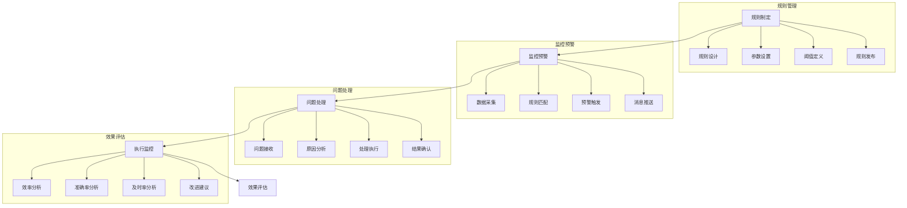

# 库存预警系统设计

> 远哥说：库存预警是防范库存风险的重要手段，通过智能的预警机制和快速的响应流程，实现库存问题的提前发现和及时处理。

## 一、系统概述

### 1.1 系统定位
```
功能定位：
1. 业务目标
   - 提前发现风险
   - 及时处理问题
   - 降低库存损失
   - 优化库存管理

2. 系统价值
   - 风险防范
   - 损失控制
   - 效率提升
   - 决策支持

3. 用户角色
   - 预警主管：制定规则
   - 监控员：执行监控
   - 处理员：问题处理
   - 管理层：决策支持
```

### 1.2 核心功能
| 模块 | 功能点 | 业务价值 | 实现难点 |
|------|--------|----------|----------|
| 规则管理 | 规则制定 | 科学预警 | 规则优化 |
| 监控预警 | 实时监控 | 及时发现 | 精准预警 |
| 处理管理 | 问题处理 | 快速响应 | 处理效率 |
| 效果评估 | 效果分析 | 持续改进 | 指标体系 |

### 1.3 核心业务流程



## 二、功能设计

### 2.1 规则管理
```
功能模块：
1. 规则设计
   - 规则模型
   - 参数设置
   - 阈值定义
   - 规则验证

2. 分类管理
   - 预警类型
   - 风险等级
   - 处理优先级
   - 响应时限

3. 参数管理
   - 预警阈值
   - 触发条件
   - 响应时间
   - 升级规则

4. 维护管理
   - 规则更新
   - 规则优化
   - 规则停用
   - 规则归档
```

### 2.2 预警管理
```
功能模块：
1. 数据监控
   - 数据采集
   - 数据验证
   - 数据分析
   - 异常识别

2. 预警触发
   - 规则匹配
   - 预警生成
   - 等级判定
   - 消息推送

3. 处理管理
   - 问题接收
   - 原因分析
   - 处理执行
   - 结果确认

4. 跟踪管理
   - 处理跟踪
   - 时效监控
   - 升级处理
   - 结果评估
```

## 三、流程设计

### 3.1 业务流程
```
流程步骤：
1. 规则制定
   - 规则设计
   - 参数设置
   - 阈值定义
   - 规则发布

2. 监控预警
   - 数据采集
   - 规则匹配
   - 预警触发
   - 消息推送

3. 问题处理
   - 问题接收
   - 原因分析
   - 处理执行
   - 结果确认

4. 效果评估
   - 数据采集
   - 指标计算
   - 效果分析
   - 改进建议
```

### 3.2 管理流程
| 阶段 | 工作内容 | 负责人 | 输出物 |
|------|----------|--------|--------|
| 规则阶段 | 规则制定 | 预警主管 | 规则方案 |
| 监控阶段 | 监控预警 | 监控员 | 预警单 |
| 处理阶段 | 问题处理 | 处理员 | 处理单 |
| 评估阶段 | 效果评估 | 分析员 | 评估报告 |

## 四、系统实现

### 4.1 技术架构
```
系统架构：
1. 前端技术
   - Web端：Vue.js
   - 移动端：Flutter
   - 图表：ECharts
   - UI框架：Element UI

2. 后端技术
   - 开发语言：Java
   - 框架：Spring Cloud
   - 数据库：ClickHouse
   - 消息队列：RabbitMQ

3. 算法模型
   - 监控算法
   - 预警算法
   - 分析算法
   - 评估算法

4. 部署架构
   - 容器化：Docker
   - 编排：Kubernetes
   - 网关：Kong
   - 监控：Prometheus
```

### 4.2 数据模型
| 实体 | 属性 | 关系 | 说明 |
|------|------|------|------|
| 规则 | 规则信息 | 1:n | 主体 |
| 预警 | 预警信息 | n:1 | 从属 |
| 处理 | 处理信息 | n:1 | 从属 |
| 评估 | 评估信息 | n:1 | 从属 |

## 五、运营策略

### 5.1 预警策略
```
策略方向：
1. 监控策略
   - 全面监控
   - 重点监控
   - 分级监控
   - 智能监控

2. 预警策略
   - 及时预警
   - 准确预警
   - 分级预警
   - 联动预警

3. 处理策略
   - 快速响应
   - 分级处理
   - 协同处理
   - 闭环管理

4. 优化策略
   - 规则优化
   - 流程优化
   - 效率优化
   - 持续改进
```

### 5.2 优化方向
| 方向 | 措施 | 目标 | 效果 |
|------|------|------|------|
| 规则优化 | 智能规则 | 准确预警 | 效率提升 |
| 监控优化 | 全面监控 | 及时发现 | 风险降低 |
| 处理优化 | 快速处理 | 及时解决 | 损失减少 |
| 管理优化 | 制度完善 | 规范管理 | 持续改进 |