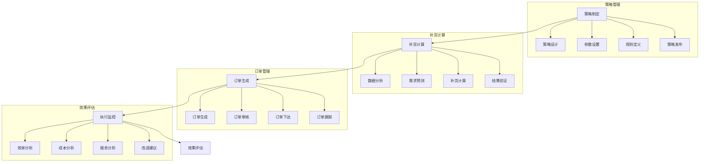

# 补货策略系统设计

> 远哥说：补货策略是库存管理的核心环节，通过科学的补货方法和智能的决策机制，实现库存水平的最优化和供应的连续性。

## 一、系统概述

### 1.1 系统定位
功能定位：
1. 业务目标
   - 优化补货时机
   - 优化补货量
   - 降低库存成本
   - 保障供应连续

2. 系统价值
   - 智能补货
   - 成本优化
   - 效率提升
   - 决策支持

3. 用户角色
   - 策略主管：制定策略
   - 补货员：执行补货
   - 采购员：订单执行
   - 仓储员：库存管理

### 1.2 核心功能
| 模块 | 功能点 | 业务价值 | 实现难点 |
|------|--------|----------|----------|
| 策略管理 | 策略制定 | 科学补货 | 策略优化 |
| 补货计算 | 智能计算 | 量化决策 | 算法精度 |
| 订单管理 | 订单生成 | 自动执行 | 流程优化 |
| 效果评估 | 效果分析 | 持续改进 | 指标体系 |

### 1.3 核心业务流程

## 二、功能设计

### 2.1 策略管理
功能模块：
1. 策略设计
   - 策略模型
   - 参数设置
   - 规则定义
   - 策略验证

2. 分类管理
   - ABC分类
   - 需求分类
   - 价值分类
   - 特性分类

3. 参数管理
   - 安全库存
   - 补货点
   - 补货量
   - 补货周期

4. 规则管理
   - 规则设置
   - 规则验证
   - 规则发布
   - 规则维护

### 2.2 补货管理
功能模块：
1. 数据分析
   - 销售分析
   - 库存分析
   - 成本分析
   - 趋势分析

2. 补货计算
   - 需求预测
   - 库存检查
   - 补货计算
   - 结果验证

3. 订单管理
   - 订单生成
   - 订单审核
   - 订单下达
   - 订单跟踪

4. 异常管理
   - 异常识别
   - 原因分析
   - 处理方案
   - 结果确认

## 三、流程设计

### 3.1 业务流程
流程步骤：
1. 策略制定
   - 策略设计
   - 参数设置
   - 规则定义
   - 策略发布

2. 补货计算
   - 数据分析
   - 需求预测
   - 补货计算
   - 结果验证

3. 订单管理
   - 订单生成
   - 订单审核
   - 订单执行
   - 订单跟踪

4. 效果评估
   - 数据采集
   - 指标计算
   - 效果分析
   - 改进建议

### 3.2 管理流程
| 阶段 | 工作内容 | 负责人 | 输出物 |
|------|----------|--------|--------|
| 策略阶段 | 策略制定 | 策略主管 | 策略方案 |
| 计算阶段 | 补货计算 | 补货员 | 补货单 |
| 执行阶段 | 订单执行 | 采购员 | 采购单 |
| 评估阶段 | 效果评估 | 分析员 | 评估报告 |

## 四、系统实现

### 4.1 技术架构
系统架构：
1. 前端技术
   - Web端：React
   - 移动端：React Native
   - 图表：ECharts
   - UI框架：Ant Design

2. 后端技术
   - 开发语言：Python
   - 框架：FastAPI
   - 数据库：MongoDB
   - 消息队列：Kafka

3. 算法模型
   - 预测算法
   - 优化算法
   - 分析算法
   - 评估算法

4. 部署架构
   - 容器化：Docker
   - 编排：Kubernetes
   - 网关：Nginx
   - 监控：Grafana

### 4.2 数据模型
| 实体 | 属性 | 关系 | 说明 |
|------|------|------|------|
| 策略 | 策略信息 | 1:n | 主体 |
| 补货 | 补货信息 | n:1 | 从属 |
| 订单 | 订单信息 | n:1 | 从属 |
| 评估 | 评估信息 | n:1 | 从属 |

## 五、运营策略

### 5.1 补货策略
策略方向：
1. 分类策略
   - ABC分类
   - 需求分类
   - 价值分类
   - 特性分类

2. 补货策略
   - 定期补货
   - 定量补货
   - 混合补货
   - 智能补货

3. 执行策略
   - 自动补货
   - 人工干预
   - 异常处理
   - 应急处理

4. 优化策略
   - 参数优化
   - 规则优化
   - 流程优化
   - 持续改进

### 5.2 优化方向
| 方向 | 措施 | 目标 | 效果 |
|------|------|------|------|
| 策略优化 | 智能策略 | 科学补货 | 效率提升 |
| 计算优化 | 精准计算 | 准确补货 | 成本降低 |
| 执行优化 | 自动执行 | 及时补货 | 服务提升 |
| 管理优化 | 制度完善 | 规范管理 | 持续改进 |