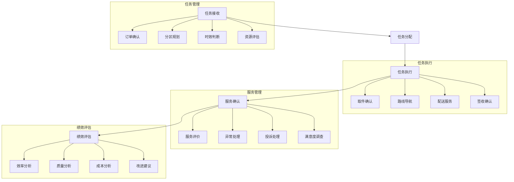

# 末端配送系统设计

> 远哥说：末端配送是物流服务的最后一公里，直接面对终端客户，对服务质量和客户体验有着重要影响。

## 一、系统概述

### 1.1 系统定位
```
功能定位：
1. 业务目标
   - 提高配送效率
   - 降低配送成本
   - 提升服务质量
   - 优化客户体验

2. 系统价值
   - 服务标准化
   - 作业规范化
   - 管理精细化
   - 体验优质化

3. 用户角色
   - 配送主管：计划管理
   - 配送员：任务执行
   - 客服：服务支持
   - 客户：服务接收
```

### 1.2 核心功能
| 模块 | 功能点 | 业务价值 | 实现难点 |
|------|--------|----------|----------|
| 任务管理 | 任务分配 | 高效执行 | 资源调配 |
| 路线规划 | 路线优化 | 效率提升 | 实时优化 |
| 服务管理 | 服务保障 | 体验提升 | 标准执行 |
| 绩效管理 | 绩效评估 | 持续改进 | 指标体系 |

### 1.3 核心业务流程



## 二、功能设计

### 2.1 任务管理
```
功能模块：
1. 任务接收
   - 订单确认
   - 时效判断
   - 区域划分
   - 资源评估

2. 任务分配
   - 人员分配
   - 路线规划
   - 时间安排
   - 任务下发

3. 任务执行
   - 取件确认
   - 路线导航
   - 配送服务
   - 签收确认

4. 任务监控
   - 实时跟踪
   - 异常处理
   - 进度管理
   - 质量控制
```

### 2.2 服务管理
```
功能模块：
1. 服务规范
   - 服务标准
   - 操作规范
   - 礼仪要求
   - 着装要求

2. 服务执行
   - 上门服务
   - 礼貌用语
   - 物品交接
   - 签收确认

3. 服务评价
   - 满意度评价
   - 服务反馈
   - 投诉处理
   - 改进建议

4. 服务改进
   - 问题分析
   - 方案制定
   - 措施执行
   - 效果评估
```

## 三、流程设计

### 3.1 业务流程
```
流程步骤：
1. 任务准备
   - 任务接收
   - 资源评估
   - 路线规划
   - 任务分配

2. 任务执行
   - 取件确认
   - 路线导航
   - 配送服务
   - 签收确认

3. 服务管理
   - 服务规范
   - 服务执行
   - 服务评价
   - 服务改进

4. 绩效评估
   - 数据采集
   - 指标计算
   - 效果分析
   - 改进建议
```

### 3.2 管理流程
| 阶段 | 工作内容 | 负责人 | 输出物 |
|------|----------|--------|--------|
| 准备阶段 | 任务规划 | 主管 | 计划单 |
| 执行阶段 | 配送服务 | 配送员 | 配送单 |
| 确认阶段 | 服务确认 | 客户 | 签收单 |
| 评估阶段 | 绩效评估 | 分析员 | 评估报告 |

## 四、系统实现

### 4.1 技术架构
```
系统架构：
1. 前端技术
   - Web端：React
   - 移动端：React Native
   - 地图：高德地图

2. 后端技术
   - 开发语言：Java
   - 框架：Spring Cloud
   - 数据库：MySQL
   - 缓存：Redis

3. 算法模型
   - 路线规划
   - 资源优化
   - 效率分析
   - 评估模型

4. 部署架构
   - 容器化：Docker
   - 编排：Kubernetes
   - 网关：Nginx
   - 监控：Grafana
```

### 4.2 数据模型
| 实体 | 属性 | 关系 | 说明 |
|------|------|------|------|
| 任务 | 任务信息 | 1:n | 主体 |
| 配送 | 配送信息 | n:1 | 从属 |
| 服务 | 服务信息 | n:1 | 从属 |
| 评估 | 评估信息 | n:1 | 从属 |

## 五、运营策略

### 5.1 服务策略
```
策略方向：
1. 服务标准
   - 时效标准
   - 质量标准
   - 服务标准
   - 安全标准

2. 激励策略
   - 绩效激励
   - 质量激励
   - 服务激励
   - 创新激励

3. 培训策略
   - 岗前培训
   - 技能培训
   - 服务培训
   - 安全培训

4. 管理策略
   - 过程管理
   - 质量管理
   - 成本管理
   - 风险管理
```

### 5.2 优化方向
| 方向 | 措施 | 目标 | 效果 |
|------|------|------|------|
| 效率提升 | 流程优化 | 效率最高 | 成本降低 |
| 质量改善 | 标准执行 | 差错最少 | 投诉减少 |
| 服务提升 | 规范服务 | 体验最佳 | 满意提升 |
| 成本控制 | 资源优化 | 成本最低 | 效益提升 |