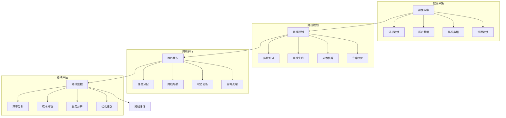

# 路线优化系统设计

> 远哥说：路线优化是物流配送效率提升的关键，科学的路线规划能够降低配送成本，提高配送效率，提升客户满意度。

## 一、系统概述

### 1.1 系统定位
```
功能定位：
1. 业务目标
   - 降低配送成本
   - 提高配送效率
   - 优化配送路线
   - 提升服务体验

2. 系统价值
   - 路线智能化
   - 成本最小化
   - 效率最大化
   - 服务优质化

3. 用户角色
   - 规划主管：方案审批
   - 调度员：路线规划
   - 配送员：路线执行
   - 客服：订单处理
```

### 1.2 核心功能
| 模块 | 功能点 | 业务价值 | 实现难点 |
|------|--------|----------|----------|
| 路线规划 | 智能规划 | 效率提升 | 算法优化 |
| 路线调整 | 实时优化 | 灵活应对 | 动态处理 |
| 路线监控 | 状态跟踪 | 及时响应 | 异常处理 |
| 路线评估 | 效果分析 | 持续改进 | 指标体系 |

### 1.3 核心业务流程



## 二、功能设计

### 2.1 路线规划
```
功能模块：
1. 数据采集
   - 订单数据采集
   - 历史数据分析
   - 路况数据获取
   - 资源数据统计

2. 区域划分
   - 配送区域划分
   - 订单密度分析
   - 时效性要求
   - 资源限制评估

3. 路线生成
   - 智能路线规划
   - 多目标优化
   - 约束条件处理
   - 方案比较选择

4. 方案优化
   - 成本优化
   - 时效优化
   - 距离优化
   - 资源优化
```

### 2.2 路线执行
```
功能模块：
1. 任务分配
   - 任务拆分
   - 资源匹配
   - 时间安排
   - 任务下发

2. 路线导航
   - 实时导航
   - 路况提醒
   - 路线偏离预警
   - 到达时间预测

3. 状态更新
   - 位置更新
   - 任务状态更新
   - 异常情况记录
   - 完成情况确认

4. 异常处理
   - 路况异常
   - 车辆异常
   - 订单异常
   - 其他异常
```

## 三、流程设计

### 3.1 业务流程
```
流程步骤：
1. 数据准备
   - 数据采集
   - 数据清洗
   - 数据分析
   - 数据验证

2. 路线规划
   - 区域划分
   - 路线生成
   - 方案优化
   - 方案确定

3. 路线执行
   - 任务分配
   - 路线导航
   - 状态更新
   - 异常处理

4. 效果评估
   - 数据统计
   - 指标计算
   - 效果分析
   - 优化建议
```

### 3.2 管理流程
| 阶段 | 工作内容 | 负责人 | 输出物 |
|------|----------|--------|--------|
| 规划阶段 | 方案制定 | 主管 | 规划方案 |
| 执行阶段 | 路线实施 | 配送员 | 执行单 |
| 监控阶段 | 状态跟踪 | 调度员 | 监控单 |
| 评估阶段 | 效果评估 | 分析员 | 评估报告 |

## 四、系统实现

### 4.1 技术架构
```
系统架构：
1. 前端技术
   - Web端：Vue.js
   - 移动端：Flutter
   - 地图：高德地图

2. 后端技术
   - 开发语言：Python
   - 框架：Django
   - 数据库：MongoDB
   - 缓存：Redis

3. 算法模型
   - 路线规划算法
   - 优化算法
   - 预测算法
   - 评估算法

4. 部署架构
   - 容器化：Docker
   - 编排：Kubernetes
   - 网关：Kong
   - 监控：Prometheus
```

### 4.2 数据模型
| 实体 | 属性 | 关系 | 说明 |
|------|------|------|------|
| 路线 | 路线信息 | 1:n | 主体 |
| 订单 | 订单信息 | n:1 | 从属 |
| 资源 | 资源信息 | n:1 | 从属 |
| 评估 | 评估信息 | n:1 | 从属 |

## 五、运营策略

### 5.1 优化策略
```
策略方向：
1. 成本策略
   - 里程优化
   - 时间优化
   - 油耗优化
   - 人工优化

2. 效率策略
   - 订单整合
   - 资源匹配
   - 时效保障
   - 异常处理

3. 服务策略
   - 准时送达
   - 客户满意
   - 异常处理
   - 服务评价

4. 资源策略
   - 人员配置
   - 车辆调度
   - 设备利用
   - 成本控制
```

### 5.2 优化方向
| 方向 | 措施 | 目标 | 效果 |
|------|------|------|------|
| 成本降低 | 路线优化 | 成本最小 | 效益提升 |
| 效率提升 | 智能调度 | 效率最高 | 时效保障 |
| 服务改善 | 标准执行 | 体验提升 | 客户满意 |
| 资源优化 | 统筹安排 | 资源高效 | 综合平衡 |