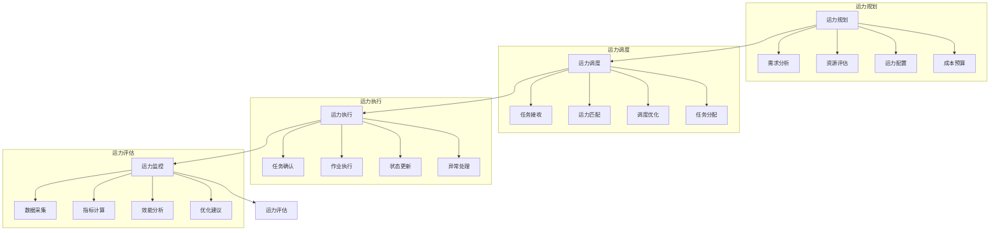

# 运力管理系统设计

> 远哥说：运力管理是物流配送的核心资源，科学的运力管理能够提高资源利用率，降低运营成本，保障配送服务质量。

## 一、系统概述

### 1.1 系统定位
```
功能定位：
1. 业务目标
   - 提高运力利用率
   - 降低运营成本
   - 保障服务质量
   - 优化资源配置

2. 系统价值
   - 运力可视化
   - 调度智能化
   - 管理精细化
   - 决策数据化

3. 用户角色
   - 运力主管：资源规划
   - 调度员：运力调配
   - 驾驶员：任务执行
   - 维保人员：车辆维护
```

### 1.2 核心功能
| 模块 | 功能点 | 业务价值 | 实现难点 |
|------|--------|----------|----------|
| 运力规划 | 资源配置 | 合理布局 | 需求预测 |
| 运力调度 | 任务分配 | 高效利用 | 实时优化 |
| 运力监控 | 状态跟踪 | 及时响应 | 异常处理 |
| 运力评估 | 效能分析 | 持续改进 | 指标体系 |

### 1.3 核心业务流程



## 二、功能设计

### 2.1 运力规划
```
功能模块：
1. 需求分析
   - 历史数据分析
   - 市场需求预测
   - 季节性分析
   - 特殊需求评估

2. 资源评估
   - 现有运力盘点
   - 运力能力评估
   - 成本效益分析
   - 资源缺口分析

3. 运力配置
   - 运力类型规划
   - 运力规模确定
   - 区域分布优化
   - 配置方案制定

4. 成本管理
   - 固定成本核算
   - 变动成本预测
   - 成本结构优化
   - 预算方案制定
```

### 2.2 运力调度
```
功能模块：
1. 任务管理
   - 任务接收
   - 任务分类
   - 任务优先级
   - 任务时效性

2. 运力匹配
   - 运力状态查询
   - 运力能力匹配
   - 成本效益评估
   - 最优选择推荐

3. 调度优化
   - 实时调度优化
   - 多任务组合
   - 路线优化
   - 时效性保障

4. 执行监控
   - 任务执行跟踪
   - 异常情况处理
   - 实时状态更新
   - 完成情况确认
```

## 三、流程设计

### 3.1 业务流程
```
流程步骤：
1. 运力规划
   - 需求分析
   - 资源评估
   - 方案制定
   - 预算控制

2. 运力调度
   - 任务接收
   - 运力匹配
   - 调度优化
   - 任务分配

3. 运力执行
   - 任务确认
   - 作业执行
   - 状态更新
   - 完成确认

4. 运力评估
   - 数据采集
   - 指标计算
   - 效能分析
   - 优化改进
```

### 3.2 管理流程
| 阶段 | 工作内容 | 负责人 | 输出物 |
|------|----------|--------|--------|
| 规划阶段 | 资源规划 | 主管 | 规划方案 |
| 调度阶段 | 任务调度 | 调度员 | 调度单 |
| 执行阶段 | 任务执行 | 驾驶员 | 执行单 |
| 评估阶段 | 效能评估 | 分析员 | 评估报告 |

## 四、系统实现

### 4.1 技术架构
```
系统架构：
1. 前端技术
   - Web端：React
   - 移动端：React Native
   - 地图：百度地图

2. 后端技术
   - 开发语言：Java
   - 框架：Spring Boot
   - 数据库：PostgreSQL
   - 缓存：Redis

3. 算法模型
   - 需求预测
   - 资源优化
   - 路径规划
   - 成本核算

4. 部署架构
   - 容器化：Docker
   - 编排：Kubernetes
   - 网关：Nginx
   - 监控：Grafana
```

### 4.2 数据模型
| 实体 | 属性 | 关系 | 说明 |
|------|------|------|------|
| 运力 | 运力信息 | 1:n | 主体 |
| 任务 | 任务信息 | n:1 | 从属 |
| 路线 | 路线信息 | n:1 | 从属 |
| 评估 | 评估信息 | n:1 | 从属 |

## 五、运营策略

### 5.1 运力策略
```
策略方向：
1. 运力结构
   - 自有运力
   - 外包运力
   - 临时运力
   - 战略合作

2. 调度策略
   - 固定调度
   - 动态调度
   - 应急调度
   - 协同调度

3. 成本策略
   - 成本核算
   - 成本控制
   - 成本优化
   - 效益提升

4. 服务策略
   - 服务标准
   - 服务监控
   - 服务评估
   - 服务改进
```

### 5.2 优化方向
| 方向 | 措施 | 目标 | 效果 |
|------|------|------|------|
| 效率提升 | 智能调度 | 运力优化 | 成本降低 |
| 质量保障 | 标准执行 | 服务提升 | 客户满意 |
| 成本控制 | 资源整合 | 成本优化 | 效益提升 |
| 服务优化 | 流程改进 | 体验提升 | 竞争力强 |