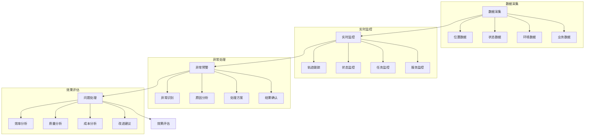

# 配送监控系统设计

> 远哥说：配送监控是物流管理的重要环节，通过实时监控和数据分析，能够及时发现和处理异常情况，保障配送服务质量。

## 一、系统概述

### 1.1 系统定位
```
功能定位：
1. 业务目标
   - 实时监控配送
   - 及时处理异常
   - 保障服务质量
   - 提升管理效率

2. 系统价值
   - 可视化监控
   - 智能预警
   - 数据分析
   - 决策支持

3. 用户角色
   - 监控主管：总体监控
   - 调度员：异常处理
   - 配送员：任务执行
   - 客服：服务支持
```

### 1.2 核心功能
| 模块 | 功能点 | 业务价值 | 实现难点 |
|------|--------|----------|----------|
| 实时监控 | 状态跟踪 | 及时掌控 | 数据实时性 |
| 异常预警 | 智能预警 | 提前预防 | 规则设计 |
| 数据分析 | 效能分析 | 持续改进 | 指标体系 |
| 决策支持 | 优化建议 | 科学决策 | 模型构建 |

### 1.3 核心业务流程



## 二、功能设计

### 2.1 实时监控
```
功能模块：
1. 轨迹监控
   - 位置跟踪
   - 轨迹回放
   - 路线偏离
   - 停留分析

2. 状态监控
   - 车辆状态
   - 人员状态
   - 任务状态
   - 环境状态

3. 任务监控
   - 进度监控
   - 时效监控
   - 质量监控
   - 异常监控

4. 服务监控
   - 服务质量
   - 客户满意度
   - 投诉处理
   - 服务评价
```

### 2.2 异常管理
```
功能模块：
1. 异常预警
   - 规则设置
   - 阈值定义
   - 预警触发
   - 消息推送

2. 异常处理
   - 问题识别
   - 原因分析
   - 方案制定
   - 处理执行

3. 异常跟踪
   - 处理进度
   - 处理结果
   - 效果评估
   - 经验总结

4. 预防管理
   - 风险识别
   - 预防措施
   - 应急预案
   - 持续改进
```

## 三、流程设计

### 3.1 业务流程
```
流程步骤：
1. 数据采集
   - 数据接入
   - 数据清洗
   - 数据存储
   - 数据分析

2. 实时监控
   - 轨迹监控
   - 状态监控
   - 任务监控
   - 服务监控

3. 异常处理
   - 异常识别
   - 原因分析
   - 方案制定
   - 处理执行

4. 效果评估
   - 数据统计
   - 指标计算
   - 效果分析
   - 改进建议
```

### 3.2 管理流程
| 阶段 | 工作内容 | 负责人 | 输出物 |
|------|----------|--------|--------|
| 监控阶段 | 实时监控 | 监控员 | 监控报告 |
| 预警阶段 | 异常预警 | 系统 | 预警信息 |
| 处理阶段 | 问题处理 | 调度员 | 处理单 |
| 评估阶段 | 效果评估 | 分析员 | 评估报告 |

## 四、系统实现

### 4.1 技术架构
```
系统架构：
1. 前端技术
   - Web端：Vue.js
   - 移动端：Flutter
   - 地图：百度地图

2. 后端技术
   - 开发语言：Java
   - 框架：Spring Boot
   - 数据库：ClickHouse
   - 消息队列：Kafka

3. 算法模型
   - 预警算法
   - 分析算法
   - 预测算法
   - 评估算法

4. 部署架构
   - 容器化：Docker
   - 编排：Kubernetes
   - 网关：Kong
   - 监控：Prometheus
```

### 4.2 数据模型
| 实体 | 属性 | 关系 | 说明 |
|------|------|------|------|
| 监控 | 监控信息 | 1:n | 主体 |
| 预警 | 预警信息 | n:1 | 从属 |
| 处理 | 处理信息 | n:1 | 从属 |
| 评估 | 评估信息 | n:1 | 从属 |

## 五、运营策略

### 5.1 监控策略
```
策略方向：
1. 监控策略
   - 全程监控
   - 重点监控
   - 异常监控
   - 质量监控

2. 预警策略
   - 及时预警
   - 分级预警
   - 智能预警
   - 联动预警

3. 处理策略
   - 快速响应
   - 分级处理
   - 协同处理
   - 闭环管理

4. 改进策略
   - 数据分析
   - 问题总结
   - 方案优化
   - 持续改进
```

### 5.2 优化方向
| 方向 | 措施 | 目标 | 效果 |
|------|------|------|------|
| 监控优化 | 智能监控 | 全面掌控 | 效率提升 |
| 预警优化 | 精准预警 | 提前预防 | 风险降低 |
| 处理优化 | 快速处理 | 及时解决 | 服务保障 |
| 分析优化 | 深度分析 | 持续改进 | 管理提升 |