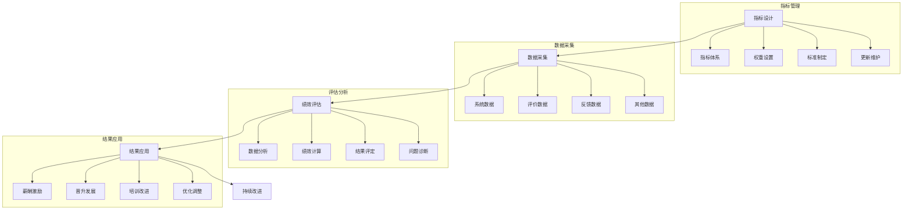

# 配送绩效系统设计

> 远哥说：配送绩效管理是提升物流服务质量和运营效率的重要手段，通过科学的评估体系和激励机制，促进配送服务的持续改进。

## 一、系统概述

### 1.1 系统定位
```
功能定位：
1. 业务目标
   - 评估服务质量
   - 提升运营效率
   - 优化成本结构
   - 激励人员发展

2. 系统价值
   - 量化评估
   - 精准激励
   - 持续改进
   - 人才发展

3. 用户角色
   - 绩效主管：制定标准
   - 评估员：执行评估
   - 配送员：被评估者
   - 人事：激励实施
```

### 1.2 核心功能
| 模块 | 功能点 | 业务价值 | 实现难点 |
|------|--------|----------|----------|
| 指标管理 | 指标设计 | 科学评估 | 指标体系 |
| 数据采集 | 数据收集 | 客观公正 | 数据准确 |
| 绩效评估 | 评估分析 | 持续改进 | 评估方法 |
| 激励管理 | 激励实施 | 人才发展 | 激励机制 |

### 1.3 核心业务流程



## 二、功能设计

### 2.1 指标管理
```
功能模块：
1. 指标体系
   - 效率指标
   - 质量指标
   - 服务指标
   - 成本指标

2. 标准制定
   - 评估标准
   - 计算方法
   - 权重设置
   - 阈值定义

3. 指标维护
   - 指标更新
   - 标准调整
   - 权重优化
   - 版本管理

4. 应用管理
   - 指标应用
   - 效果评估
   - 问题诊断
   - 持续改进
```

### 2.2 评估管理
```
功能模块：
1. 数据采集
   - 系统数据
   - 评价数据
   - 反馈数据
   - 其他数据

2. 绩效计算
   - 数据处理
   - 指标计算
   - 结果汇总
   - 报告生成

3. 结果评定
   - 等级评定
   - 结果确认
   - 申诉处理
   - 结果发布

4. 结果应用
   - 薪酬激励
   - 晋升发展
   - 培训改进
   - 优化调整
```

## 三、流程设计

### 3.1 业务流程
```
流程步骤：
1. 指标设计
   - 指标确定
   - 标准制定
   - 权重设置
   - 评估方法

2. 数据采集
   - 数据收集
   - 数据验证
   - 数据处理
   - 数据存储

3. 绩效评估
   - 数据分析
   - 指标计算
   - 结果评定
   - 报告生成

4. 结果应用
   - 结果确认
   - 结果应用
   - 问题改进
   - 持续优化
```

### 3.2 管理流程
| 阶段 | 工作内容 | 负责人 | 输出物 |
|------|----------|--------|--------|
| 设计阶段 | 指标设计 | 绩效主管 | 指标体系 |
| 采集阶段 | 数据采集 | 评估员 | 原始数据 |
| 评估阶段 | 绩效评估 | 评估员 | 评估报告 |
| 应用阶段 | 结果应用 | 人事 | 激励方案 |

## 四、系统实现

### 4.1 技术架构
```
系统架构：
1. 前端技术
   - Web端：Vue.js
   - 移动端：Flutter
   - 图表：ECharts
   - UI框架：Element UI

2. 后端技术
   - 开发语言：Python
   - 框架：Django
   - 数据库：PostgreSQL
   - 缓存：Redis

3. 算法模型
   - 统计算法
   - 分析算法
   - 评估算法
   - 预测算法

4. 部署架构
   - 容器化：Docker
   - 编排：Kubernetes
   - 网关：Kong
   - 监控：Grafana
```

### 4.2 数据模型
| 实体 | 属性 | 关系 | 说明 |
|------|------|------|------|
| 指标 | 指标信息 | 1:n | 主体 |
| 数据 | 数据信息 | n:1 | 从属 |
| 评估 | 评估信息 | n:1 | 从属 |
| 结果 | 结果信息 | n:1 | 从属 |

## 五、运营策略

### 5.1 评估策略
```
策略方向：
1. 评估策略
   - 全面评估
   - 客观公正
   - 及时反馈
   - 持续改进

2. 激励策略
   - 物质激励
   - 精神激励
   - 发展激励
   - 团队激励

3. 改进策略
   - 问题诊断
   - 方案制定
   - 措施实施
   - 效果评估

4. 发展策略
   - 能力提升
   - 职业发展
   - 团队建设
   - 文化建设
```

### 5.2 优化方向
| 方向 | 措施 | 目标 | 效果 |
|------|------|------|------|
| 指标优化 | 科学设计 | 准确评估 | 公平公正 |
| 数据优化 | 准确采集 | 数据可靠 | 评估准确 |
| 评估优化 | 方法改进 | 结果客观 | 效果提升 |
| 激励优化 | 机制创新 | 充分激励 | 持续发展 |
