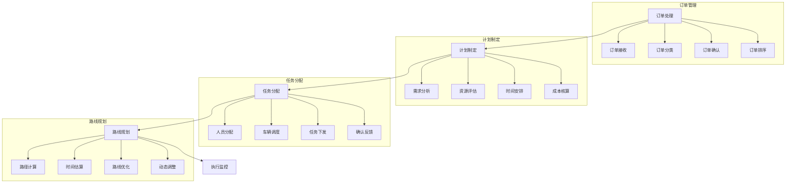

# 配送计划管理系统设计

> 远哥说：配送计划是物流管理的基础，好的配送计划系统能够优化配送资源，提高配送效率，降低配送成本。

## 一、系统概述

### 1.1 系统定位
```
功能定位：
1. 业务目标
   - 优化配送资源
   - 提高配送效率
   - 降低配送成本
   - 提升服务质量

2. 系统价值
   - 计划智能化
   - 调度自动化
   - 监控可视化
   - 决策科学化

3. 用户角色
   - 配送主管：计划审批
   - 调度员：资源调配
   - 配送员：任务执行
   - 客服：订单处理
```

### 1.2 核心功能
| 模块 | 功能点 | 业务价值 | 实现难点 |
|------|--------|----------|----------|
| 订单管理 | 订单处理 | 需求明确 | 信息完整 |
| 计划制定 | 资源规划 | 效率提升 | 算法优化 |
| 任务分配 | 人车调度 | 合理分配 | 实时调整 |
| 路线规划 | 路径优化 | 成本降低 | 约束处理 |

### 1.3 核心业务流程



## 二、功能设计

### 2.1 订单管理
```
功能模块：
1. 订单接收
   - 订单录入
   - 信息校验
   - 分类标记
   - 优先级设定

2. 订单处理
   - 订单确认
   - 时效判断
   - 资源评估
   - 特殊处理

3. 订单分析
   - 订单量预测
   - 区域分布
   - 时效分析
   - 成本核算

4. 异常处理
   - 信息异常
   - 时效异常
   - 地址异常
   - 其他异常
```

### 2.2 计划制定
```
功能模块：
1. 需求分析
   - 订单汇总
   - 区域划分
   - 时效要求
   - 特殊需求

2. 资源评估
   - 人员状态
   - 车辆状态
   - 仓储状态
   - 路况状态

3. 计划生成
   - 任务分解
   - 资源匹配
   - 时间安排
   - 成本核算

4. 计划优化
   - 效率优化
   - 成本优化
   - 路线优化
   - 时效优化
```

## 三、流程设计

### 3.1 业务流程
```
流程步骤：
1. 订单接收
   - 订单录入
   - 信息校验
   - 分类标记
   - 优先排序

2. 计划制定
   - 需求分析
   - 资源评估
   - 计划生成
   - 计划优化

3. 任务分配
   - 人员调度
   - 车辆安排
   - 任务下发
   - 确认反馈

4. 执行监控
   - 任务跟踪
   - 异常处理
   - 状态更新
   - 结果评估
```

### 3.2 管理流程
| 阶段 | 工作内容 | 负责人 | 输出物 |
|------|----------|--------|--------|
| 订单处理 | 订单确认 | 客服 | 订单单 |
| 计划制定 | 资源规划 | 主管 | 计划单 |
| 任务分配 | 人车调度 | 调度员 | 任务单 |
| 执行监控 | 状态跟踪 | 监控员 | 监控单 |

## 四、系统实现

### 4.1 技术架构
```
系统架构：
1. 前端技术
   - Web端：Vue.js
   - 移动端：Flutter
   - 地图：高德地图

2. 后端技术
   - 开发语言：Java
   - 框架：Spring Cloud
   - 数据库：MySQL
   - 缓存：Redis

3. 算法模型
   - 预测算法
   - 规划算法
   - 优化算法
   - 路径算法

4. 部署架构
   - 容器化：Docker
   - 编排：Kubernetes
   - 网关：Kong
   - 监控：Prometheus
```

### 4.2 数据模型
| 实体 | 属性 | 关系 | 说明 |
|------|------|------|------|
| 订单 | 订单信息 | 1:n | 主体 |
| 计划 | 计划明细 | n:1 | 从属 |
| 任务 | 任务内容 | n:1 | 从属 |
| 路线 | 路线信息 | n:1 | 从属 |

## 五、运营策略

### 5.1 配送策略
```
策略方向：
1. 时效策略
   - 定时配送
   - 预约配送
   - 加急配送
   - 特殊配送

2. 区域策略
   - 区域划分
   - 密度分析
   - 路线规划
   - 资源配置

3. 调度策略
   - 人员调度
   - 车辆调度
   - 路线调度
   - 任务调度

4. 成本策略
   - 人工成本
   - 车辆成本
   - 燃料成本
   - 其他成本
```

### 5.2 优化方向
| 方向 | 措施 | 目标 | 效果 |
|------|------|------|------|
| 效率提升 | 智能调度 | 配送加快 | 成本降低 |
| 准确控制 | 实时监控 | 差错减少 | 质量提升 |
| 成本优化 | 资源整合 | 成本降低 | 效益提升 |
| 服务改善 | 流程优化 | 体验提升 | 客户满意 |