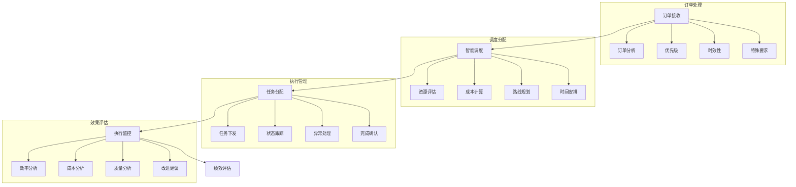

# 配送调度系统设计

> 远哥说：配送调度是物流系统的核心环节，通过智能调度和资源优化，实现配送效率的最大化和成本的最小化。

## 一、系统概述

### 1.1 系统定位
```
功能定位：
1. 业务目标
   - 优化资源配置
   - 提高配送效率
   - 降低运营成本
   - 提升服务质量

2. 系统价值
   - 智能调度
   - 资源优化
   - 效率提升
   - 成本控制

3. 用户角色
   - 调度主管：总体调度
   - 调度员：具体执行
   - 配送员：任务执行
   - 客服：服务支持
```

### 1.2 核心功能
| 模块 | 功能点 | 业务价值 | 实现难点 |
|------|--------|----------|----------|
| 智能调度 | 任务分配 | 效率最优 | 算法优化 |
| 资源管理 | 资源调配 | 成本最低 | 资源平衡 |
| 路线规划 | 路线优化 | 时效最短 | 实时计算 |
| 绩效评估 | 数据分析 | 持续改进 | 指标体系 |

### 1.3 核心业务流程



## 二、功能设计

### 2.1 智能调度
```
功能模块：
1. 订单处理
   - 订单分析
   - 优先级设置
   - 时效判断
   - 特殊处理

2. 资源评估
   - 人员评估
   - 车辆评估
   - 时间评估
   - 成本评估

3. 任务分配
   - 智能匹配
   - 路线规划
   - 时间安排
   - 任务下发

4. 执行监控
   - 实时跟踪
   - 异常处理
   - 调整优化
   - 完成确认
```

### 2.2 资源管理
```
功能模块：
1. 人员管理
   - 人员档案
   - 技能评估
   - 工作安排
   - 绩效考核

2. 车辆管理
   - 车辆档案
   - 状态监控
   - 维护保养
   - 使用调度

3. 时间管理
   - 排班管理
   - 时间分配
   - 休息安排
   - 加班管理

4. 成本管理
   - 人工成本
   - 车辆成本
   - 燃料成本
   - 维护成本
```

## 三、流程设计

### 3.1 业务流程
```
流程步骤：
1. 订单接收
   - 订单确认
   - 信息核实
   - 分类处理
   - 优先级设置

2. 智能调度
   - 资源评估
   - 成本计算
   - 路线规划
   - 时间安排

3. 任务执行
   - 任务下发
   - 状态跟踪
   - 异常处理
   - 完成确认

4. 效果评估
   - 数据采集
   - 指标计算
   - 效果分析
   - 改进建议
```

### 3.2 管理流程
| 阶段 | 工作内容 | 负责人 | 输出物 |
|------|----------|--------|--------|
| 接单阶段 | 订单处理 | 客服 | 订单单 |
| 调度阶段 | 智能调度 | 调度员 | 调度单 |
| 执行阶段 | 任务执行 | 配送员 | 配送单 |
| 评估阶段 | 效果评估 | 分析员 | 评估报告 |

## 四、系统实现

### 4.1 技术架构
```
系统架构：
1. 前端技术
   - Web端：React
   - 移动端：React Native
   - 地图：高德地图
   - UI框架：Ant Design

2. 后端技术
   - 开发语言：Java
   - 框架：Spring Cloud
   - 数据库：MongoDB
   - 消息队列：RabbitMQ

3. 算法模型
   - 调度算法
   - 路径算法
   - 成本算法
   - 评估算法

4. 部署架构
   - 容器化：Docker
   - 编排：Kubernetes
   - 网关：Nginx
   - 监控：ELK
```

### 4.2 数据模型
| 实体 | 属性 | 关系 | 说明 |
|------|------|------|------|
| 订单 | 订单信息 | 1:n | 主体 |
| 调度 | 调度信息 | n:1 | 从属 |
| 资源 | 资源信息 | n:1 | 从属 |
| 评估 | 评估信息 | n:1 | 从属 |

## 五、运营策略

### 5.1 调度策略
```
策略方向：
1. 调度策略
   - 智能调度
   - 动态调度
   - 实时调度
   - 应急调度

2. 资源策略
   - 优化配置
   - 合理调配
   - 弹性调整
   - 应急补充

3. 执行策略
   - 标准执行
   - 异常处理
   - 协同配合
   - 持续改进

4. 评估策略
   - 数据分析
   - 效果评估
   - 问题诊断
   - 优化改进
```

### 5.2 优化方向
| 方向 | 措施 | 目标 | 效果 |
|------|------|------|------|
| 调度优化 | 智能调度 | 效率最优 | 成本降低 |
| 资源优化 | 合理配置 | 利用最高 | 浪费减少 |
| 路线优化 | 实时规划 | 时效最短 | 效率提升 |
| 成本优化 | 精细管理 | 成本最低 | 利润提升 |
