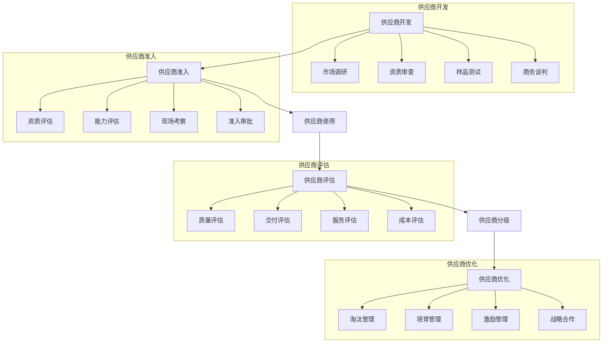
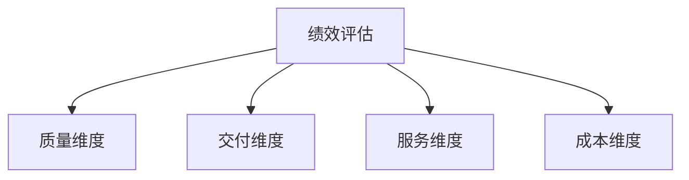

# 供应商管理系统设计

> 远哥说：供应商管理是采购管理的基础，好的供应商管理系统能够帮助企业建立稳定、高效的供应链网络。

## 一、系统概述

### 1.1 系统定位

```
功能定位：
1. 业务目标
   - 规范供应商管理流程
   - 提升供应商管理效率
   - 降低采购成本和风险
   - 优化供应商结构

2. 系统价值
   - 供应商全生命周期管理
   - 供应商绩效评估体系
   - 供应商协同管理平台
   - 供应商数据分析决策

3. 用户角色
   - 采购经理：审批管理
   - 采购专员：日常操作
   - 供应商：信息维护
   - 财务：结算管理
```

### 1.2 核心功能

| 模块 | 功能点 | 业务价值 | 实现难点 |
|------|--------|----------|----------|
| 准入管理 | 资质审核 | 风险控制 | 标准统一 |
| 绩效评估 | 多维度评价 | 优化结构 | 指标设计 |
| 协同管理 | 信息共享 | 提升效率 | 流程打通 |
| 风险管理 | 预警监控 | 降低风险 | 模型构建 |

### 1.3 核心业务流程



## 二、功能设计

### 2.1 准入管理

```
功能模块：
1. 基础信息
   - 企业信息
   - 资质证照
   - 经营范围
   - 财务状况

2. 资质审核
   - 准入标准
   - 实地考察
   - 样品评估
   - 价格评估

3. 合作签约
   - 合同管理
   - 账期设置
   - 结算方式
   - 合作条款

4. 分级管理
   - 供应商分类
   - 等级评定
   - 准入门槛
   - 权限管理
```

### 2.2 绩效评估



### 2.3 评估指标

| 维度 | 指标 | 权重 | 计算方法 |
|------|------|------|----------|
| 质量 | 合格率 | 30% | 合格数/总数 |
| 交付 | 及时率 | 30% | 按时交付率 |
| 服务 | 响应度 | 20% | 问题解决率 |
| 成本 | 价格 | 20% | 市场对比 |

## 三、流程设计

### 3.1 准入流程

流程步骤：

1. 信息提交
   - 基础信息
   - 资质文件
   - 产品信息
   - 报价信息

2. 资质审核
   - 文件审核
   - 背景调查
   - 实地考察
   - 样品测试

3. 商务谈判
   - 价格谈判
   - 账期谈判
   - 合作方式
   - 服务标准

4. 签约合作
   - 合同签订
   - 系统配置
   - 账号开通
   - 培训交接

### 3.2 评估流程

| 阶段 | 工作内容 | 负责人 | 输出物 |
|------|----------|--------|--------|
| 数据收集 | 指标采集 | 采购专员 | 原始数据 |
| 数据分析 | 指标计算 | 系统自动 | 评分结果 |
| 结果审核 | 评估审核 | 采购经理 | 评估报告 |
| 结果应用 | 等级调整 | 采购总监 | 管理措施 |

## 四、系统实现

### 4.1 技术架构

```
系统架构：
1. 前端技术
   - Web端：React
   - 移动端：React Native
   - 管理端：Ant Design Pro

2. 后端技术
   - 开发语言：Java
   - 框架：Spring Cloud
   - 数据库：MySQL
   - 缓存：Redis

3. 中间件
   - 消息队列：RabbitMQ
   - 搜索引擎：Elasticsearch
   - 文件存储：OSS
   - 监控：Prometheus

4. 部署架构
   - 容器化：Docker
   - 编排：Kubernetes
   - 网关：Nginx
   - 负载均衡：LVS
```

### 4.2 数据模型

| 实体 | 属性 | 关系 | 说明 |
|------|------|------|------|
| 供应商 | 基础信息 | 1:n | 主体 |
| 资质 | 证照信息 | n:1 | 从属 |
| 评估 | 评分记录 | n:1 | 从属 |
| 合同 | 合作信息 | n:1 | 从属 |

## 五、运营策略

### 5.1 供应商策略

```
策略方向：
1. 分级管理
   - 战略供应商
   - 核心供应商
   - 一般供应商
   - 备选供应商

2. 激励机制
   - 订单倾斜
   - 账期优化
   - 流程简化
   - 深度合作

3. 退出机制
   - 主动退出
   - 被动退出
   - 暂停合作
   - 终止合作

4. 发展策略
   - 培养计划
   - 能力提升
   - 战略合作
   - 资源整合
```

### 5.2 优化方向

| 方向 | 措施 | 目标 | 效果 |
|------|------|------|------|
| 结构优化 | 分类管理 | 供应链稳定 | 降本增效 |
| 能力提升 | 培训赋能 | 服务改善 | 质量提升 |
| 协同加强 | 系统对接 | 效率提升 | 成本下降 |
| 风险防控 | 预警机制 | 风险可控 | 持续经营 |
