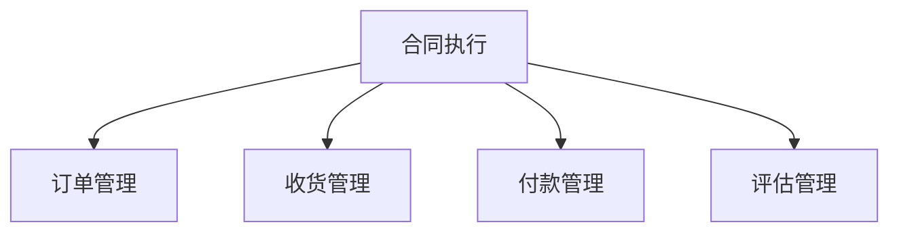

# 采购合同管理系统设计

> 远哥说：合同管理是采购管理中的重要环节，好的合同管理系统能够帮助企业规范合作关系、控制采购风险。

## 一、系统概述

### 1.1 系统定位
```
功能定位：
1. 业务目标
   - 规范合同管理
   - 控制合同风险
   - 提升执行效率
   - 优化合作关系

2. 系统价值
   - 流程规范化
   - 风险可控化
   - 执行透明化
   - 管理数字化

3. 用户角色
   - 采购经理：合同审批
   - 采购专员：合同执行
   - 法务：合同审核
   - 财务：付款管理
```

### 1.2 核心功能
| 模块 | 功能点 | 业务价值 | 实现难点 |
|------|--------|----------|----------|
| 合同起草 | 模板管理 | 规范管理 | 场景覆盖 |
| 合同审批 | 流程管理 | 风险控制 | 权限设计 |
| 合同执行 | 履约管理 | 效率提升 | 过程监控 |
| 合同评估 | 绩效分析 | 持续优化 | 指标设计 |

## 二、功能设计

### 2.1 合同管理
```
功能模块：
1. 模板管理
   - 模板库
   - 条款库
   - 场景配置
   - 版本控制

2. 合同起草
   - 信息填写
   - 条款选择
   - 参数设置
   - 文档生成

3. 审批流程
   - 业务审核
   - 法务审核
   - 财务审核
   - 领导审批

4. 合同存档
   - 电子归档
   - 实物归档
   - 分类管理
   - 检索查询
```

### 2.2 合同执行


### 2.3 评估维度
| 维度 | 指标 | 权重 | 评分方法 |
|------|------|------|----------|
| 履约 | 执行率 | 40% | 完成度 |
| 质量 | 合格率 | 30% | 检验结果 |
| 时效 | 及时率 | 20% | 时间比对 |
| 配合 | 响应度 | 10% | 满意度 |

## 三、流程设计

### 3.1 合同流程
```
流程步骤：
1. 合同准备
   - 需求确认
   - 模板选择
   - 条款准备
   - 参数设置

2. 合同审批
   - 业务审核
   - 法务审核
   - 财务审核
   - 最终审批

3. 合同签署
   - 文本确认
   - 盖章签字
   - 合同装订
   - 合同归档

4. 合同执行
   - 订单下达
   - 收货确认
   - 付款结算
   - 评估反馈
```

### 3.2 评估流程
| 阶段 | 工作内容 | 负责人 | 输出物 |
|------|----------|--------|--------|
| 执行监控 | 进度跟踪 | 采购专员 | 执行报告 |
| 质量检验 | 验收确认 | 质检人员 | 检验报告 |
| 绩效评估 | 指标计算 | 采购经理 | 评估报告 |
| 持续改进 | 问题优化 | 采购总监 | 改进方案 |

## 四、系统实现

### 4.1 技术架构
```
系统架构：
1. 前端技术
   - Web端：Vue.js
   - 移动端：Flutter
   - 文档：PDF.js

2. 后端技术
   - 开发语言：Java
   - 框架：Spring Cloud
   - 数据库：Oracle
   - 缓存：Redis

3. 中间件
   - 工作流：Flowable
   - 文档管理：Alfresco
   - 电子签章：E-Sign
   - 存储：OSS

4. 部署架构
   - 容器化：Docker
   - 编排：Kubernetes
   - 网关：Gateway
   - 监控：Skywalking
```

### 4.2 数据模型
| 实体 | 属性 | 关系 | 说明 |
|------|------|------|------|
| 合同 | 基本信息 | 1:n | 主体 |
| 条款 | 条款内容 | n:1 | 从属 |
| 附件 | 文档信息 | n:1 | 从属 |
| 执行 | 履约记录 | n:1 | 从属 |

## 五、运营策略

### 5.1 合同策略
```
策略方向：
1. 合同类型
   - 框架合同
   - 采购合同
   - 服务合同
   - 临时合同

2. 签署方式
   - 线下签署
   - 电子签署
   - 混合签署
   - 远程签署

3. 管理策略
   - 分类管理
   - 分级管理
   - 分权管理
   - 分期管理

4. 风险控制
   - 法律风险
   - 商务风险
   - 履约风险
   - 信用风险
```

### 5.2 优化方向
| 方向 | 措施 | 目标 | 效果 |
|------|------|------|------|
| 效率提升 | 流程优化 | 周期缩短 | 成本降低 |
| 风险控制 | 审核加强 | 风险降低 | 损失减少 |
| 执行改进 | 监控完善 | 履约提升 | 满意提高 |
| 体系优化 | 标准统一 | 管理规范 | 效益增长 |