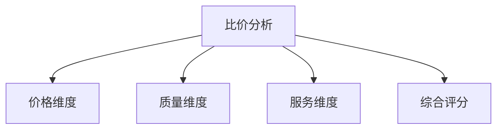

# 询价比价管理系统设计

> 远哥说：询价比价是采购成本控制的关键环节，好的询价比价系统能够帮助企业获得最优的采购价格和条件。

## 一、系统概述

### 1.1 系统定位
功能定位：
1. 业务目标
   - 规范询价流程
   - 优化比价策略
   - 降低采购成本
   - 提高采购效率

2. 系统价值
   - 价格透明化
   - 决策科学化
   - 过程规范化
   - 结果最优化

3. 用户角色
   - 采购经理：策略制定
   - 采购专员：询价执行
   - 供应商：报价响应
   - 财务：成本核算

### 1.2 核心功能
| 模块 | 功能点 | 业务价值 | 实现难点 |
|------|--------|----------|----------|
| 询价管理 | 询价发布 | 价格发现 | 标准统一 |
| 报价管理 | 报价收集 | 数据完整 | 格式规范 |
| 比价分析 | 多维对比 | 决策支持 | 模型设计 |
| 价格管理 | 历史追溯 | 成本控制 | 数据治理 |

## 二、功能设计

### 2.1 询价管理
功能模块：
1. 询价准备
   - 需求分析
   - 市场调研
   - 策略制定
   - 文件准备

2. 询价发布
   - 供应商筛选
   - 询价单生成
   - 信息发布
   - 进度跟踪

3. 过程管理
   - 答疑澄清
   - 补充说明
   - 变更管理
   - 截止管理

4. 结果管理
   - 报价汇总
   - 有效性验证
   - 异常处理
   - 结果确认

### 2.2 比价分析

### 2.3 评估维度
| 维度 | 指标 | 权重 | 评分方法 |
|------|------|------|----------|
| 价格 | 报价水平 | 40% | 相对评分 |
| 质量 | 产品质量 | 30% | 等级评分 |
| 服务 | 服务能力 | 20% | 打分评级 |
| 条件 | 商务条款 | 10% | 比较评分 |

## 三、流程设计

### 3.1 询价流程
流程步骤：
1. 需求确认
   - 技术规格
   - 质量要求
   - 交付要求
   - 服务要求

2. 询价准备
   - 供应商选择
   - 询价文件
   - 评估标准
   - 时间安排

3. 询价执行
   - 信息发布
   - 过程管理
   - 答疑处理
   - 报价收集

4. 结果处理
   - 开标评审
   - 技术评估
   - 商务谈判
   - 结果确认

### 3.2 比价流程
| 阶段 | 工作内容 | 负责人 | 输出物 |
|------|----------|--------|--------|
| 数据收集 | 报价汇总 | 采购专员 | 报价表 |
| 初步筛选 | 有效性审核 | 采购经理 | 筛选报告 |
| 详细分析 | 多维评估 | 评审小组 | 分析报告 |
| 结果应用 | 供应商选择 | 采购总监 | 决策方案 |

## 四、系统实现

### 4.1 技术架构
系统架构：
1. 前端技术
   - Web端：React
   - 移动端：React Native
   - 可视化：AntV

2. 后端技术
   - 开发语言：Java
   - 框架：Spring Boot
   - 数据库：MySQL
   - 缓存：Redis

3. 中间件
   - 消息队列：Kafka
   - 搜索引擎：Elasticsearch
   - 文件存储：MinIO
   - 工作流：Activiti

4. 部署架构
   - 容器化：Docker
   - 编排：Kubernetes
   - 网关：Kong
   - 监控：Prometheus

### 4.2 数据模型
| 实体 | 属性 | 关系 | 说明 |
|------|------|------|------|
| 询价单 | 询价信息 | 1:n | 主体 |
| 报价单 | 报价信息 | n:1 | 从属 |
| 评估表 | 评分记录 | n:1 | 从属 |
| 价格表 | 历史价格 | n:1 | 从属 |

## 五、运营策略

### 5.1 询价策略
策略方向：
1. 询价方式
   - 公开询价
   - 邀请询价
   - 定向询价
   - 竞争性谈判

2. 报价策略
   - 一次报价
   - 多轮报价
   - 最优报价
   - 竞价排名

3. 评估策略
   - 最低价法
   - 综合评分法
   - 性价比法
   - 总成本法

4. 谈判策略
   - 价格谈判
   - 条款谈判
   - 服务谈判
   - 战略合作

### 5.2 优化方向
| 方向 | 措施 | 目标 | 效果 |
|------|------|------|------|
| 价格优化 | 竞价机制 | 成本降低 | 利润提升 |
| 效率提升 | 流程优化 | 周期缩短 | 响应加快 |
| 质量保证 | 标准完善 | 质量提升 | 风险降低 |
| 供应保障 | 策略优化 | 供应稳定 | 业务增长 |