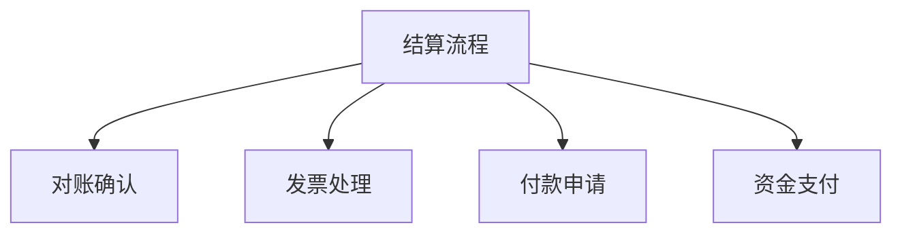

# 采购结算管理系统设计

> 远哥说：采购结算是采购管理的最后一环，好的结算系统能够帮助企业提高资金使用效率、降低财务风险。

## 一、系统概述

### 1.1 系统定位
功能定位：
1. 业务目标
   - 规范结算流程
   - 提高结算效率
   - 控制结算风险
   - 优化资金管理

2. 系统价值
   - 流程自动化
   - 数据准确性
   - 风险可控性
   - 效率提升性

3. 用户角色
   - 采购经理：结算审批
   - 采购专员：单据管理
   - 财务：付款处理
   - 供应商：对账确认

### 1.2 核心功能
| 模块 | 功能点 | 业务价值 | 实现难点 |
|------|--------|----------|----------|
| 对账管理 | 单据核对 | 准确性高 | 数据一致 |
| 发票管理 | 票据处理 | 合规性强 | 税务管理 |
| 付款管理 | 资金支付 | 效率提升 | 资金安全 |
| 统计分析 | 数据报表 | 决策支持 | 维度设计 |

## 二、功能设计

### 2.1 对账管理
功能模块：
1. 单据管理
   - 采购订单
   - 收货单据
   - 验收单据
   - 结算单据

2. 对账处理
   - 自动对账
   - 差异分析
   - 异常处理
   - 确认核销

3. 账期管理
   - 账期设置
   - 信用管理
   - 预警提醒
   - 逾期处理

4. 结算方式
   - 现金结算
   - 承兑汇票
   - 信用证
   - 供应链金融

### 2.2 结算流程

### 2.3 评估维度
| 维度 | 指标 | 权重 | 评分方法 |
|------|------|------|----------|
| 及时性 | 结算周期 | 30% | 时效评分 |
| 准确性 | 差错率 | 30% | 正确率 |
| 合规性 | 票据合规 | 20% | 合规率 |
| 效率性 | 处理效率 | 20% | 效率比 |

## 三、流程设计

### 3.1 结算流程
流程步骤：
1. 对账准备
   - 单据收集
   - 数据核对
   - 差异分析
   - 问题处理

2. 发票处理
   - 发票验证
   - 税务处理
   - 入账登记
   - 档案管理

3. 付款申请
   - 付款计划
   - 审批流程
   - 资金计划
   - 支付安排

4. 资金支付
   - 支付审核
   - 付款执行
   - 回单确认
   - 账务处理

### 3.2 审批流程
| 阶段 | 工作内容 | 负责人 | 输出物 |
|------|----------|--------|--------|
| 单据审核 | 单据验证 | 采购专员 | 审核报告 |
| 金额审核 | 金额核对 | 财务会计 | 核对报告 |
| 付款审批 | 支付审批 | 财务经理 | 审批单 |
| 支付确认 | 付款确认 | 出纳 | 支付凭证 |

## 四、系统实现

### 4.1 技术架构
系统架构：
1. 前端技术
   - Web端：Angular
   - 移动端：React Native
   - 报表：ECharts

2. 后端技术
   - 开发语言：Java
   - 框架：Spring Boot
   - 数据库：MySQL
   - 缓存：Redis

3. 中间件
   - 消息队列：RocketMQ
   - 工作流：Activiti
   - 报表：JasperReport
   - 监控：Prometheus

4. 部署架构
   - 容器化：Docker
   - 编排：Kubernetes
   - 网关：Nginx
   - 日志：ELK

### 4.2 数据模型
| 实体 | 属性 | 关系 | 说明 |
|------|------|------|------|
| 结算单 | 结算信息 | 1:n | 主体 |
| 发票 | 票据信息 | n:1 | 从属 |
| 付款单 | 支付信息 | n:1 | 从属 |
| 账务 | 财务信息 | n:1 | 从属 |

## 五、运营策略

### 5.1 结算策略
策略方向：
1. 结算方式
   - 现金结算
   - 票据结算
   - 信用结算
   - 融资结算

2. 账期策略
   - 固定账期
   - 灵活账期
   - 信用账期
   - 特殊账期

3. 付款策略
   - 集中付款
   - 分散付款
   - 定期付款
   - 临时付款

4. 风险控制
   - 信用风险
   - 资金风险
   - 操作风险
   - 合规风险

### 5.2 优化方向
| 方向 | 措施 | 目标 | 效果 |
|------|------|------|------|
| 效率提升 | 自动化处理 | 周期缩短 | 成本降低 |
| 风险控制 | 预警机制 | 风险降低 | 损失减少 |
| 资金优化 | 计划管理 | 效率提升 | 收益增加 |
| 合规管理 | 制度完善 | 合规运营 | 风险可控 |