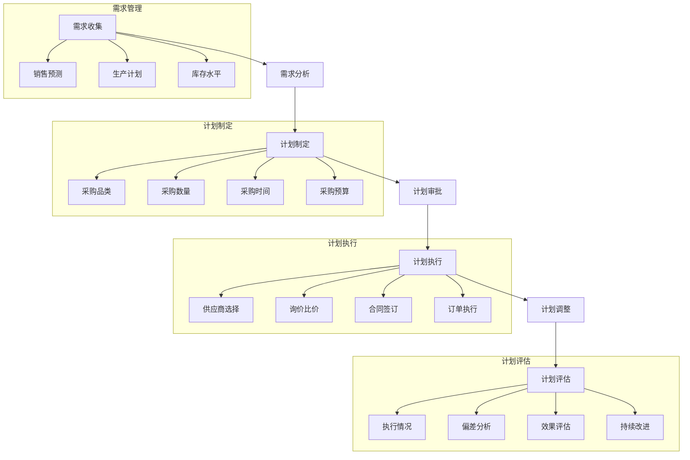
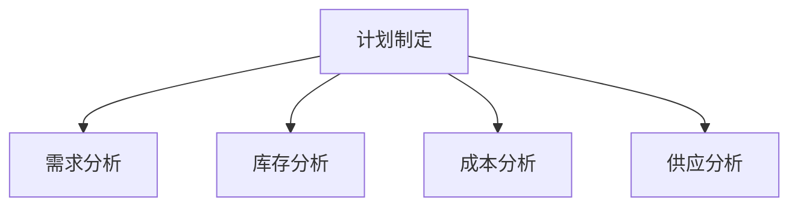

# 采购计划管理系统设计

> 远哥说：好的采购计划是降低采购成本、保证供应稳定的关键，需要平衡需求预测、库存水平和采购成本。

## 一、系统概述

### 1.1 系统定位
```
功能定位：
1. 业务目标
   - 优化采购计划
   - 降低采购成本
   - 保证供应稳定
   - 提高计划准确性

2. 系统价值
   - 需求预测准确
   - 库存水平合理
   - 采购成本降低
   - 供应风险可控

3. 用户角色
   - 计划经理：计划审批
   - 计划专员：计划制定
   - 采购专员：计划执行
   - 仓库：库存管理
```

### 1.2 核心功能
| 模块 | 功能点 | 业务价值 | 实现难点 |
|------|--------|----------|----------|
| 需求预测 | 销量预测 | 准确性提升 | 算法模型 |
| 计划制定 | 采购策略 | 成本优化 | 多维平衡 |
| 计划执行 | 订单管理 | 执行效率 | 过程监控 |
| 计划评估 | 绩效分析 | 持续改进 | 指标设计 |

### 1.3 核心业务流程



## 二、功能设计

### 2.1 需求预测
```
功能模块：
1. 数据收集
   - 历史销量
   - 市场趋势
   - 促销计划
   - 季节因素

2. 预测模型
   - 时间序列
   - 回归分析
   - 机器学习
   - 组合预测

3. 预测调整
   - 人工干预
   - 异常处理
   - 参数调整
   - 结果验证

4. 预测应用
   - 计划指导
   - 库存优化
   - 成本控制
   - 风险预警
```

### 2.2 计划制定


### 2.3 计划策略
| 策略 | 适用场景 | 优点 | 缺点 |
|------|----------|------|------|
| JIT采购 | 稳定需求 | 库存低 | 风险高 |
| 批量采购 | 规模经济 | 成本低 | 库存高 |
| 战略采购 | 关键物料 | 供应稳定 | 成本高 |
| 季节采购 | 周期性需求 | 保证供应 | 资金占用 |

## 三、流程设计

### 3.1 计划流程
```
流程步骤：
1. 需求分析
   - 销量预测
   - 库存分析
   - 安全库存
   - 补货周期

2. 计划制定
   - 采购数量
   - 采购时间
   - 供应商选择
   - 预算控制

3. 计划审批
   - 部门审核
   - 预算审核
   - 风险评估
   - 计划确认

4. 计划执行
   - 订单下达
   - 进度跟踪
   - 异常处理
   - 计划调整
```

### 3.2 评估流程
| 阶段 | 工作内容 | 负责人 | 输出物 |
|------|----------|--------|--------|
| 计划制定 | 需求分析 | 计划专员 | 计划方案 |
| 计划审核 | 方案评估 | 计划经理 | 审核意见 |
| 计划执行 | 订单管理 | 采购专员 | 执行报告 |
| 计划评估 | 效果分析 | 计划经理 | 评估报告 |

## 四、系统实现

### 4.1 技术架构
```
系统架构：
1. 前端技术
   - Web端：Vue.js
   - 移动端：Flutter
   - 可视化：ECharts

2. 后端技术
   - 开发语言：Python
   - 框架：FastAPI
   - 数据库：PostgreSQL
   - 缓存：Redis

3. 算法模型
   - 预测算法：Prophet
   - 机器学习：Scikit-learn
   - 深度学习：TensorFlow
   - 优化算法：Gurobi

4. 部署架构
   - 容器化：Docker
   - 编排：Kubernetes
   - 监控：Grafana
   - 日志：ELK
```

### 4.2 数据模型
| 实体 | 属性 | 关系 | 说明 |
|------|------|------|------|
| 需求 | 预测数据 | 1:n | 主体 |
| 计划 | 采购计划 | n:1 | 从属 |
| 订单 | 执行记录 | n:1 | 从属 |
| 评估 | 绩效数据 | n:1 | 从属 |

## 五、运营策略

### 5.1 计划策略
```
策略方向：
1. 分类管理
   - A类物料：战略采购
   - B类物料：批量采购
   - C类物料：JIT采购
   - D类物料：按需采购

2. 优化方向
   - 预测准确率
   - 库存周转率
   - 采购成本率
   - 供应及时率

3. 风险管理
   - 需求波动
   - 价格波动
   - 供应中断
   - 质量风险

4. 持续改进
   - 流程优化
   - 系统升级
   - 人员培训
   - 绩效提升
```

### 5.2 优化方向
| 方向 | 措施 | 目标 | 效果 |
|------|------|------|------|
| 预测优化 | 算法改进 | 准确率提升 | 库存优化 |
| 成本控制 | 策略优化 | 成本降低 | 利润提升 |
| 效率提升 | 流程优化 | 效率提高 | 周期缩短 |
| 风险管理 | 预警机制 | 风险可控 | 稳定运营 |