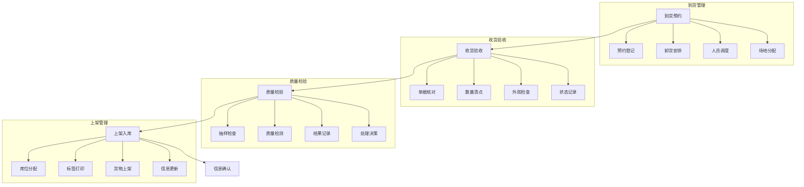
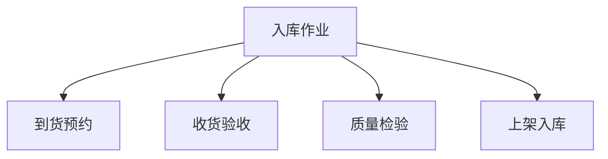

# 入库作业管理系统设计

> 远哥说：入库作业是仓储管理的起点，好的入库管理系统能够保证货物准确高效地进入仓库，为后续的仓储管理打好基础。

## 一、系统概述

### 1.1 系统定位
```
功能定位：
1. 业务目标
   - 规范入库流程
   - 提高作业效率
   - 保证数据准确
   - 优化库位分配

2. 系统价值
   - 流程标准化
   - 作业自动化
   - 数据可视化
   - 管理智能化

3. 用户角色
   - 仓库主管：计划审批
   - 收货员：货物接收
   - 质检员：质量检验
   - 理货员：上架作业
```

### 1.2 核心功能
| 模块 | 功能点 | 业务价值 | 实现难点 |
|------|--------|----------|----------|
| 到货管理 | 预约登记 | 有序接收 | 调度优化 |
| 收货管理 | 货物验收 | 准确性高 | 效率提升 |
| 质检管理 | 质量检验 | 质量保证 | 标准统一 |
| 上架管理 | 货物入库 | 库位优化 | 路径规划 |

### 1.3 核心业务流程



## 二、功能设计

### 2.1 到货管理
```
功能模块：
1. 预约登记
   - 到货预约
   - 卸货安排
   - 人员调度
   - 场地分配

2. 到货确认
   - 单据核对
   - 数量清点
   - 包装检查
   - 状态记录

3. 异常处理
   - 数量异常
   - 包装异常
   - 时间异常
   - 质量异常

4. 卸货管理
   - 卸货调度
   - 人员分配
   - 设备调配
   - 进度跟踪
```

### 2.2 作业流程


### 2.3 评估维度
| 维度 | 指标 | 权重 | 评分方法 |
|------|------|------|----------|
| 效率 | 作业时效 | 30% | 时间评分 |
| 准确 | 差错率 | 30% | 正确率 |
| 质量 | 完好率 | 20% | 合格率 |
| 成本 | 作业成本 | 20% | 成本率 |

## 三、流程设计

### 3.1 入库流程
```
流程步骤：
1. 到货预约
   - 预约登记
   - 时间安排
   - 资源调度
   - 现场准备

2. 收货验收
   - 单据核对
   - 数量清点
   - 外观检查
   - 状态记录

3. 质量检验
   - 抽样检查
   - 质量检测
   - 结果记录
   - 处理决策

4. 上架入库
   - 库位分配
   - 标签打印
   - 货物上架
   - 信息确认
```

### 3.2 作业流程
| 阶段 | 工作内容 | 负责人 | 输出物 |
|------|----------|--------|--------|
| 预约登记 | 到货安排 | 调度员 | 预约单 |
| 收货验收 | 货物接收 | 收货员 | 收货单 |
| 质量检验 | 质量检查 | 质检员 | 检验单 |
| 上架确认 | 货物上架 | 理货员 | 上架单 |

## 四、系统实现

### 4.1 技术架构
```
系统架构：
1. 前端技术
   - Web端：Vue.js
   - 移动端：Flutter
   - PDA端：React Native

2. 后端技术
   - 开发语言：Java
   - 框架：Spring Boot
   - 数据库：MySQL
   - 缓存：Redis

3. 硬件设备
   - 手持PDA
   - 条码扫描
   - RFID读写
   - 自动称重

4. 部署架构
   - 容器化：Docker
   - 编排：Kubernetes
   - 网关：Nginx
   - 监控：Prometheus
```

### 4.2 数据模型
| 实体 | 属性 | 关系 | 说明 |
|------|------|------|------|
| 预约单 | 预约信息 | 1:n | 主体 |
| 收货单 | 收货记录 | n:1 | 从属 |
| 检验单 | 质检记录 | n:1 | 从属 |
| 上架单 | 入库记录 | n:1 | 从属 |

## 五、运营策略

### 5.1 作业策略
```
策略方向：
1. 预约管理
   - 时段预约
   - 资源预约
   - 场地预约
   - 人员预约

2. 收货策略
   - 集中收货
   - 分散收货
   - 定时收货
   - 紧急收货

3. 质检策略
   - 全检
   - 抽检
   - 免检
   - 特检

4. 上架策略
   - 指定库位
   - 推荐库位
   - 随机库位
   - 临时库位
```

### 5.2 优化方向
| 方向 | 措施 | 目标 | 效果 |
|------|------|------|------|
| 效率提升 | 自动化设备 | 作业加快 | 成本降低 |
| 准确控制 | 系统校验 | 差错减少 | 质量提升 |
| 成本优化 | 资源调配 | 成本降低 | 效益提升 |
| 质量保证 | 标准执行 | 质量提升 | 客户满意 |