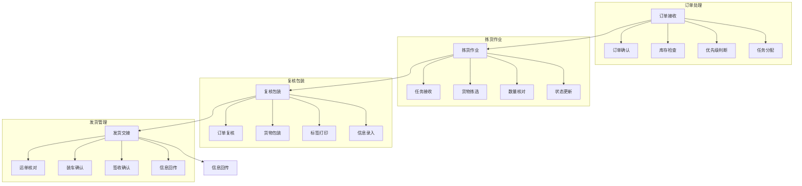
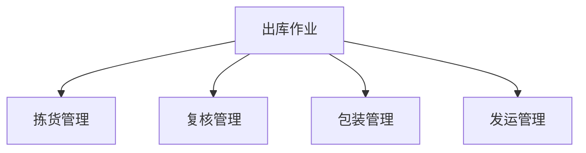

# 出库作业管理系统设计

> 远哥说：出库作业是仓储管理的最后一环，好的出库管理系统能够保证货物准确及时地送达客户手中，提升客户满意度。

## 一、系统概述

### 1.1 系统定位
```
功能定位：
1. 业务目标
   - 提高出库效率
   - 保证配送准确
   - 优化拣选流程
   - 降低作业成本

2. 系统价值
   - 作业高效化
   - 管理精细化
   - 流程智能化
   - 服务优质化

3. 用户角色
   - 仓库主管：计划审批
   - 拣货员：货物拣选
   - 复核员：订单复核
   - 打包员：包装出库
```

### 1.2 核心功能
| 模块 | 功能点 | 业务价值 | 实现难点 |
|------|--------|----------|----------|
| 拣货管理 | 订单拣选 | 效率提升 | 路径优化 |
| 复核管理 | 订单复核 | 准确保证 | 差错控制 |
| 包装管理 | 货物包装 | 安全保障 | 标准执行 |
| 发运管理 | 货物发运 | 及时送达 | 调度优化 |

### 1.3 核心业务流程



## 二、功能设计

### 2.1 拣货管理
```
功能模块：
1. 订单处理
   - 订单分析
   - 优先级排序
   - 波次分配
   - 任务下发

2. 拣选作业
   - 路径规划
   - 货物确认
   - 数量核对
   - 状态更新

3. 异常处理
   - 缺货处理
   - 库位异常
   - 数量不符
   - 质量问题

4. 效率分析
   - 时效统计
   - 准确率计算
   - 效率评估
   - 优化建议
```

### 2.2 作业流程


### 2.3 评估维度
| 维度 | 指标 | 权重 | 评分方法 |
|------|------|------|----------|
| 效率 | 出库时效 | 30% | 时间评分 |
| 准确 | 拣货准确 | 30% | 差错率 |
| 完整 | 订单完整 | 20% | 完整率 |
| 成本 | 作业成本 | 20% | 成本率 |

## 三、流程设计

### 3.1 出库流程
```
流程步骤：
1. 订单接收
   - 订单确认
   - 库存检查
   - 优先级判断
   - 任务分配

2. 拣货作业
   - 任务接收
   - 货物拣选
   - 数量核对
   - 状态更新

3. 复核包装
   - 订单复核
   - 货物包装
   - 标签打印
   - 信息录入

4. 发货交接
   - 运单核对
   - 装车确认
   - 签收确认
   - 信息回传
```

### 3.2 作业流程
| 阶段 | 工作内容 | 负责人 | 输出物 |
|------|----------|--------|--------|
| 订单处理 | 任务分配 | 主管 | 拣货单 |
| 拣货作业 | 货物拣选 | 拣货员 | 拣货记录 |
| 复核包装 | 订单复核 | 复核员 | 复核单 |
| 发货确认 | 货物发运 | 发运员 | 发运单 |

## 四、系统实现

### 4.1 技术架构
```
系统架构：
1. 前端技术
   - Web端：Vue.js
   - 移动端：Flutter
   - PDA端：React Native

2. 后端技术
   - 开发语言：Java
   - 框架：Spring Boot
   - 数据库：MySQL
   - 缓存：Redis

3. 智能设备
   - 电子标签
   - 自动分拣
   - 智能包装
   - 自动称重

4. 部署架构
   - 容器化：Docker
   - 编排：Kubernetes
   - 网关：Nginx
   - 监控：Prometheus
```

### 4.2 数据模型
| 实体 | 属性 | 关系 | 说明 |
|------|------|------|------|
| 订单 | 订单信息 | 1:n | 主体 |
| 拣货单 | 拣货记录 | n:1 | 从属 |
| 复核单 | 复核记录 | n:1 | 从属 |
| 发运单 | 发运记录 | n:1 | 从属 |

## 五、运营策略

### 5.1 作业策略
```
策略方向：
1. 拣选策略
   - 单品拣选
   - 批量拣选
   - 分区拣选
   - 波次拣选

2. 复核策略
   - 全面复核
   - 抽样复核
   - 重点复核
   - 免检放行

3. 包装策略
   - 标准包装
   - 定制包装
   - 加固包装
   - 简易包装

4. 发运策略
   - 即时发运
   - 集中发运
   - 定时发运
   - 加急发运
```

### 5.2 优化方向
| 方向 | 措施 | 目标 | 效果 |
|------|------|------|------|
| 效率提升 | 智能设备 | 作业加快 | 成本降低 |
| 准确控制 | 系统校验 | 差错减少 | 质量提升 |
| 成本优化 | 资源整合 | 成本降低 | 效益提升 |
| 服务提升 | 流程优化 | 体验改善 | 客户满意 |