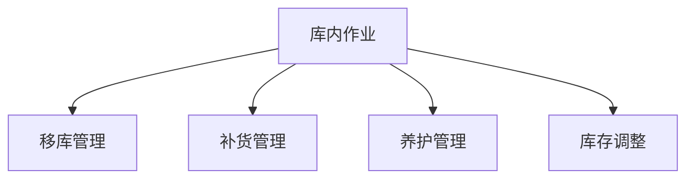

# 库内作业管理系统设计

> 远哥说：库内作业是仓储管理的核心环节，好的库内作业管理系统能够提高仓库运营效率，降低作业成本。

## 一、系统概述

### 1.1 系统定位
```
功能定位：
1. 业务目标
   - 优化作业流程
   - 提高空间利用
   - 降低作业成本
   - 保证作业质量

2. 系统价值
   - 作业智能化
   - 管理可视化
   - 调度优化化
   - 成本最小化

3. 用户角色
   - 仓库主管：计划制定
   - 调度员：任务分配
   - 作业员：任务执行
   - 质检员：质量检查
```

### 1.2 核心功能
| 模块 | 功能点 | 业务价值 | 实现难点 |
|------|--------|----------|----------|
| 移库管理 | 货位调整 | 空间优化 | 路径规划 |
| 补货管理 | 库存补充 | 拣选效率 | 时机把握 |
| 养护管理 | 商品养护 | 质量保证 | 标准执行 |
| 库存调整 | 差异处理 | 准确性高 | 原因分析 |

## 二、功能设计

### 2.1 移库管理
```
功能模块：
1. 计划制定
   - 移库原因
   - 目标库位
   - 作业时间
   - 人员安排

2. 任务执行
   - 货物确认
   - 库位校验
   - 搬运作业
   - 信息更新

3. 路径优化
   - 路线规划
   - 设备选择
   - 时间估算
   - 成本核算

4. 异常处理
   - 库位冲突
   - 货物损坏
   - 系统异常
   - 人员调整
```

### 2.2 作业流程


### 2.3 评估维度
| 维度 | 指标 | 权重 | 评分方法 |
|------|------|------|----------|
| 效率 | 作业效率 | 30% | 时效评分 |
| 准确 | 准确率 | 30% | 差错率 |
| 成本 | 作业成本 | 20% | 成本率 |
| 质量 | 作业质量 | 20% | 合格率 |

## 三、流程设计

### 3.1 作业流程
```
流程步骤：
1. 计划制定
   - 需求分析
   - 任务分解
   - 资源评估
   - 计划编制

2. 任务分配
   - 人员调度
   - 设备分配
   - 时间安排
   - 路径规划

3. 作业执行
   - 任务确认
   - 现场作业
   - 信息记录
   - 异常处理

4. 结果确认
   - 数据核对
   - 质量检查
   - 任务评估
   - 结果归档
```

### 3.2 作业类型
| 类型 | 作业内容 | 执行要点 | 注意事项 |
|------|----------|----------|----------|
| 移库作业 | 货位调整 | 路径优化 | 安全操作 |
| 补货作业 | 库存补充 | 及时性 | 准确性 |
| 养护作业 | 商品保养 | 标准执行 | 质量保证 |
| 盘点作业 | 库存核查 | 全面性 | 差异处理 |

## 四、系统实现

### 4.1 技术架构
```
系统架构：
1. 前端技术
   - Web端：React
   - 移动端：Flutter
   - PDA端：React Native

2. 后端技术
   - 开发语言：Java
   - 框架：Spring Cloud
   - 数据库：PostgreSQL
   - 缓存：Redis

3. 智能设备
   - AGV小车
   - 机器人
   - 自动输送
   - 智能穿梭

4. 部署架构
   - 容器化：Docker
   - 编排：Kubernetes
   - 网关：Kong
   - 监控：Grafana
```

### 4.2 数据模型
| 实体 | 属性 | 关系 | 说明 |
|------|------|------|------|
| 作业单 | 作业信息 | 1:n | 主体 |
| 任务单 | 任务明细 | n:1 | 从属 |
| 库位 | 位置信息 | n:1 | 从属 |
| 记录 | 操作日志 | n:1 | 从属 |

## 五、运营策略

### 5.1 作业策略
```
策略方向：
1. 移库策略
   - 计划性移库
   - 紧急性移库
   - 优化性移库
   - 养护性移库

2. 补货策略
   - 定时补货
   - 定量补货
   - 动态补货
   - 紧急补货

3. 养护策略
   - 定期养护
   - 状态养护
   - 专项养护
   - 应急养护

4. 调整策略
   - 系统调整
   - 盘点调整
   - 报损调整
   - 其他调整
```

### 5.2 优化方向
| 方向 | 措施 | 目标 | 效果 |
|------|------|------|------|
| 效率提升 | 智能设备 | 作业加快 | 成本降低 |
| 准确控制 | 系统校验 | 差错减少 | 质量提升 |
| 成本优化 | 资源整合 | 成本降低 | 效益提升 |
| 质量保证 | 标准执行 | 质量提升 | 客户满意 |