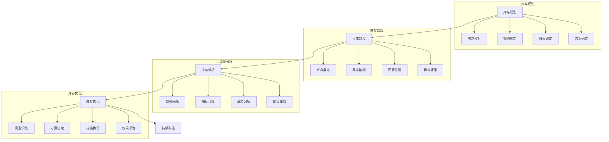
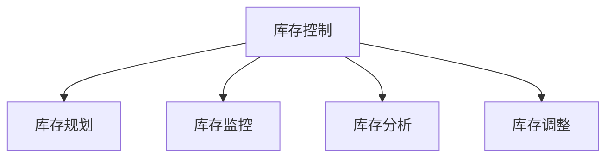

# 库存控制管理系统设计

> 远哥说：库存控制是仓储管理的核心，好的库存控制系统能够实现库存的合理配置，降低库存成本，提高资金使用效率。

## 一、系统概述

### 1.1 系统定位
```
功能定位：
1. 业务目标
   - 优化库存水平
   - 降低库存成本
   - 提高周转率
   - 防止积压呆滞

2. 系统价值
   - 管理科学化
   - 决策智能化
   - 控制精准化
   - 预警及时化

3. 用户角色
   - 库存经理：策略制定
   - 计划员：库存规划
   - 采购员：补货执行
   - 仓管员：库存管理
```

### 1.2 核心功能
| 模块 | 功能点 | 业务价值 | 实现难点 |
|------|--------|----------|----------|
| 库存规划 | 水平控制 | 成本优化 | 需求预测 |
| 库存监控 | 动态监测 | 及时预警 | 阈值设定 |
| 库存分析 | 数据分析 | 决策支持 | 模型构建 |
| 库存调整 | 结构优化 | 效率提升 | 平衡把控 |

### 1.3 核心业务流程



## 二、功能设计

### 2.1 库存规划
```
功能模块：
1. 需求预测
   - 历史分析
   - 趋势预测
   - 季节调整
   - 特殊处理

2. 库存策略
   - 安全库存
   - 补货点
   - 最大库存
   - 最小库存

3. 分类管理
   - ABC分类
   - 重要度
   - 价值分析
   - 周转分析

4. 成本控制
   - 库存成本
   - 订货成本
   - 缺货成本
   - 总成本优化
```

### 2.2 控制流程


### 2.3 评估维度
| 维度 | 指标 | 权重 | 评分方法 |
|------|------|------|----------|
| 周转 | 周转率 | 30% | 周期评分 |
| 成本 | 库存成本 | 30% | 成本率 |
| 准确 | 账实相符 | 20% | 差异率 |
| 服务 | 满足率 | 20% | 缺货率 |

## 三、流程设计

### 3.1 控制流程
```
流程步骤：
1. 库存规划
   - 需求分析
   - 策略制定
   - 目标设定
   - 方案确定

2. 日常监控
   - 库存盘点
   - 动态监测
   - 预警处理
   - 异常处理

3. 数据分析
   - 数据采集
   - 指标计算
   - 趋势分析
   - 报告生成

4. 优化调整
   - 问题识别
   - 方案制定
   - 措施执行
   - 效果评估
```

### 3.2 控制要素
| 要素 | 控制内容 | 控制方法 | 控制标准 |
|------|----------|----------|----------|
| 数量 | 库存量 | 定量控制 | 最优库存 |
| 结构 | 品类比例 | 分类控制 | ABC分类 |
| 成本 | 资金占用 | 成本控制 | 最低成本 |
| 效率 | 周转速度 | 周期控制 | 最快周转 |

## 四、系统实现

### 4.1 技术架构
```
系统架构：
1. 前端技术
   - Web端：React
   - 移动端：Flutter
   - 大屏：Echarts

2. 后端技术
   - 开发语言：Java
   - 框架：Spring Cloud
   - 数据库：PostgreSQL
   - 缓存：Redis

3. 算法模型
   - 预测算法
   - 优化算法
   - 分类算法
   - 评估模型

4. 部署架构
   - 容器化：Docker
   - 编排：Kubernetes
   - 网关：Kong
   - 监控：Grafana
```

### 4.2 数据模型
| 实体 | 属性 | 关系 | 说明 |
|------|------|------|------|
| 库存 | 库存信息 | 1:n | 主体 |
| 规划 | 规划方案 | n:1 | 从属 |
| 监控 | 监控记录 | n:1 | 从属 |
| 分析 | 分析报告 | n:1 | 从属 |

## 五、运营策略

### 5.1 控制策略
```
策略方向：
1. 补货策略
   - 定期补货
   - 定量补货
   - 混合补货
   - 联合补货

2. 库存策略
   - 安全库存
   - 季节库存
   - 周期库存
   - 战略库存

3. 分类策略
   - ABC分类
   - FSN分类
   - VED分类
   - XYZ分类

4. 优化策略
   - 库存优化
   - 结构优化
   - 成本优化
   - 效率优化
```

### 5.2 优化方向
| 方向 | 措施 | 目标 | 效果 |
|------|------|------|------|
| 周转提升 | 预测优化 | 周转加快 | 效率提高 |
| 成本降低 | 结构优化 | 成本降低 | 利润提升 |
| 准确控制 | 系统监控 | 差异减少 | 管理改善 |
| 服务提升 | 库存优化 | 服务改善 | 客户满意 |