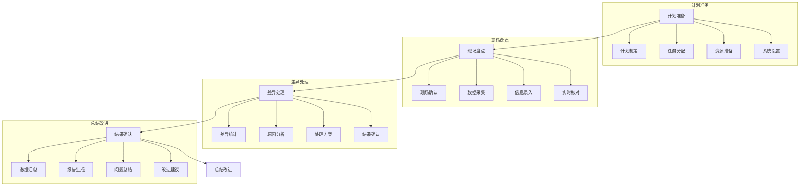
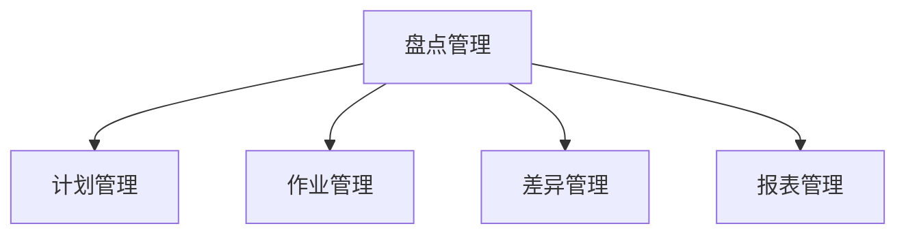

# 盘点管理系统设计

> 远哥说：盘点管理是仓储管理的重要保障，好的盘点管理系统能够及时发现并解决库存差异问题，确保账实相符。

## 一、系统概述

### 1.1 系统定位
功能定位：
1. 业务目标
   - 保证账实相符
   - 发现库存差异
   - 优化盘点效率
   - 规范盘点流程

2. 系统价值
   - 管理规范化
   - 作业智能化
   - 数据准确化
   - 问题可视化

3. 用户角色
   - 仓库主管：计划审批
   - 盘点员：现场盘点
   - 复核员：数据复核
   - 财务：账务处理

### 1.2 核心功能
| 模块 | 功能点 | 业务价值 | 实现难点 |
|------|--------|----------|----------|
| 计划管理 | 盘点计划 | 有序执行 | 资源调配 |
| 作业管理 | 现场盘点 | 准确高效 | 操作规范 |
| 差异管理 | 差异处理 | 问题解决 | 原因分析 |
| 报表管理 | 数据分析 | 决策支持 | 指标体系 |

### 1.3 核心业务流程

## 二、功能设计

### 2.1 计划管理
功能模块：
1. 计划制定
   - 盘点范围
   - 盘点时间
   - 人员安排
   - 物资准备

2. 任务分配
   - 区域划分
   - 人员分组
   - 责任明确
   - 进度控制

3. 资源调配
   - 人力资源
   - 设备工具
   - 时间安排
   - 场地准备

4. 预案管理
   - 应急预案
   - 突发处理
   - 协调机制
   - 责任追究

### 2.2 盘点流程

### 2.3 评估维度
| 维度 | 指标 | 权重 | 评分方法 |
|------|------|------|----------|
| 准确 | 准确率 | 40% | 差异率 |
| 效率 | 盘点效率 | 30% | 时效评分 |
| 成本 | 盘点成本 | 20% | 成本率 |
| 质量 | 作业质量 | 10% | 合格率 |

## 三、流程设计

### 3.1 盘点流程
流程步骤：
1. 计划准备
   - 计划制定
   - 任务分配
   - 资源准备
   - 系统设置

2. 现场盘点
   - 现场确认
   - 数据采集
   - 信息录入
   - 实时核对

3. 差异处理
   - 差异统计
   - 原因分析
   - 处理方案
   - 结果确认

4. 总结改进
   - 数据汇总
   - 报告生成
   - 问题总结
   - 改进建议

### 3.2 盘点方式
| 方式 | 适用场景 | 优点 | 缺点 |
|------|----------|------|------|
| 全面盘点 | 年度盘点 | 全面准确 | 时间长 |
| 动态盘点 | 日常盘点 | 及时发现 | 人力多 |
| 抽样盘点 | 重点物资 | 效率高 | 覆盖小 |
| 循环盘点 | 分类盘点 | 持续改进 | 协调难 |

## 四、系统实现

### 4.1 技术架构
系统架构：
1. 前端技术
   - Web端：Vue.js
   - 移动端：Flutter
   - PDA端：React Native

2. 后端技术
   - 开发语言：Java
   - 框架：Spring Boot
   - 数据库：MySQL
   - 缓存：Redis

3. 智能设备
   - 手持PDA
   - RFID读写
   - 电子秤
   - 条码枪

4. 部署架构
   - 容器化：Docker
   - 编排：Kubernetes
   - 网关：Nginx
   - 监控：Prometheus

### 4.2 数据模型
| 实体 | 属性 | 关系 | 说明 |
|------|------|------|------|
| 计划单 | 计划信息 | 1:n | 主体 |
| 盘点单 | 盘点记录 | n:1 | 从属 |
| 差异单 | 差异记录 | n:1 | 从属 |
| 处理单 | 处理记录 | n:1 | 从属 |

## 五、运营策略

### 5.1 盘点策略
策略方向：
1. 时间策略
   - 定期盘点
   - 不定期盘点
   - 临时盘点
   - 专项盘点

2. 范围策略
   - 全面盘点
   - 重点盘点
   - 抽样盘点
   - 循环盘点

3. 方式策略
   - 静态盘点
   - 动态盘点
   - 混合盘点
   - 联合盘点

4. 处理策略
   - 即时处理
   - 集中处理
   - 分级处理
   - 专项处理

### 5.2 优化方向
| 方向 | 措施 | 目标 | 效果 |
|------|------|------|------|
| 准确提升 | 智能设备 | 差错减少 | 准确提高 |
| 效率优化 | 流程优化 | 效率提升 | 成本降低 |
| 成本控制 | 资源整合 | 成本降低 | 效益提升 |
| 质量保证 | 标准执行 | 质量提升 | 管理改善 |