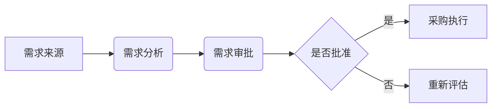

# 供应链采购管理深度解析

> 远哥说：采购管理是供应链的起点，也是成本控制的关键。作为一名资深产品专家，我将结合20年的实战经验，深入剖析采购管理的各个环节。

## 一、采购管理的核心目标

### 1.1 采购的核心价值

1. **成本控制**
   - 降低采购成本：通过优化采购流程、谈判价格、寻找替代供应商等方式降低采购成本。
   - 优化采购预算：通过预算管理、成本分析、费用控制等方式优化采购预算。
   - 提高资金利用率：通过优化付款周期、减少库存积压、提高资金周转率等方式提高资金利用率。

2. **质量保证**
   - 选择优质供应商：通过供应商评估、资质审核、样品测试等方式选择优质供应商。
   - 确保采购质量：通过质量检验、质量控制、质量追溯等方式确保采购质量。
   - 降低质量风险：通过风险评估、质量管理、质量改进等方式降低质量风险。

3. **效率提升**
   - 优化采购流程：通过流程优化、自动化、数字化等方式优化采购流程。
   - 缩短采购周期：通过快速响应、高效协同、信息共享等方式缩短采购周期。
   - 提高采购效率：通过绩效考核、流程改进、工具应用等方式提高采购效率。

4. **风险管理**
   - 识别采购风险：通过风险评估、风险分析、风险预警等方式识别采购风险。
   - 制定应对策略：通过风险规避、风险转移、风险缓解等方式制定应对策略。
   - 降低供应链风险：通过多元化采购、战略合作、信息共享等方式降低供应链风险。

### 1.2 采购管理的关键指标

| 指标类型 | 指标名称 | 计算公式 | 意义 |
|---|---|---|---|
| **采购成本** | 采购总成本 | 所有采购订单的总金额 | 反映采购支出的总额 |
| | 单位采购成本 | 采购总成本 / 采购数量 | 反映单位采购成本 |
| | 采购成本降低率 | (期初采购成本 - 期末采购成本) / 期初采购成本 | 反映采购成本降低的幅度 |
| **采购周期** | 采购提前期 | 从需求提出到货物入库的时间 | 反映采购周期的长短 |
| | 订单处理时间 | 从订单下达到供应商确认的时间 | 反映订单处理效率 |
| | 交货准时率 | 按时交货的订单数量 / 总订单数量 | 反映供应商的交货能力 |
| **供应商绩效** | 供应商合格率 | 合格供应商数量 / 总供应商数量 | 反映供应商的整体质量 |
| | 供应商交货准时率 | 按时交货的供应商数量 / 总供应商数量 | 反映供应商的交货能力 |
| | 供应商质量合格率 | 质量合格的供应商数量 / 总供应商数量 | 反映供应商的质量水平 |
| **采购质量** | 采购合格率 | 合格采购数量 / 总采购数量 | 反映采购商品的质量 |
| | 退货率 | 退货数量 / 总采购数量 | 反映采购商品的质量问题 |
| | 质量问题率 | 质量问题订单数量 / 总订单数量 | 反映采购商品的质量问题 |

## 二、采购管理的业务流程

### 2.1 采购需求管理

1. **需求来源**
   - 生产计划：根据生产计划制定采购需求，确保生产顺利进行。
   - 销售预测：根据销售预测制定采购需求，满足市场需求。
   - 库存预警：根据库存预警制定采购需求，避免库存短缺或积压。
   - 临时需求：根据临时需求制定采购需求，满足突发情况。

2. **需求分析**
   - 需求数量：确定采购数量，避免过多或过少。
   - 需求时间：确定采购时间，确保及时交货。
   - 需求规格：确定采购规格，确保符合要求。
   - 需求优先级：确定采购优先级，确保重要需求优先处理。

3. **需求审批**
   - 采购申请：提交采购申请，明确采购需求。
   - 审批流程：按照审批流程进行审批，确保合规。
   - 预算控制：控制采购预算，避免超支。



### 2.2 供应商管理

1. **供应商选择**
   - 供应商资质：审核供应商的资质，确保合法合规。
   - 供应商能力：评估供应商的生产能力、技术能力、质量管理能力等。
   - 供应商信誉：评估供应商的信誉，确保合作可靠。
   - 供应商价格：比较供应商的价格，选择性价比高的供应商。

2. **供应商评估**
   - 绩效评估：定期评估供应商的绩效，包括交货准时率、质量合格率、服务水平等。
   - 风险评估：评估供应商的风险，包括财务风险、运营风险、合规风险等。
   - 合作评估：评估与供应商的合作关系，包括沟通效率、协同程度、问题解决能力等。
   - 持续改进：与供应商共同制定改进计划，不断提升供应商的绩效。

3. **供应商关系**
   - 战略合作：与核心供应商建立战略合作关系，实现长期共赢。
   - 长期合作：与优质供应商建立长期合作关系，确保供应链稳定。
   - 伙伴关系：与供应商建立伙伴关系，共同发展。
   - 协同发展：与供应商协同发展，共同提升供应链效率。

### 2.3 采购执行

1. **询价与比价**
   - 询价渠道：通过多种渠道进行询价，包括线上平台、线下洽谈、招标等。
   - 比价方法：通过多种方法进行比价，包括价格比较、成本分析、价值评估等。
   - 价格谈判：与供应商进行价格谈判，争取最优价格。
   - 成本分析：分析采购成本，包括直接成本、间接成本、运输成本等。

2. **合同签订**
   - 合同条款：明确合同条款，包括商品名称、规格、数量、价格、交货时间、付款方式等。
   - 法律风险：评估合同的法律风险，确保合同合法有效。
   - 支付方式：选择合适的支付方式，包括预付款、货到付款、分期付款等。
   - 交付条款：明确交付条款，包括交货地点、交货方式、交货时间等。

3. **订单管理**
   - 订单下达：向供应商下达采购订单，明确采购需求。
   - 订单跟踪：跟踪订单状态，确保订单按时交付。
   - 订单变更：处理订单变更，包括数量变更、规格变更、交货时间变更等。
   - 订单取消：处理订单取消，包括取消原因、取消流程、取消费用等。

### 2.4 采购结算

1. **发票管理**
   - 发票核对：核对发票信息，确保发票真实有效。
   - 发票录入：录入发票信息，方便财务管理。
   - 发票归档：归档发票，方便查询和审计。

2. **付款管理**
   - 付款审批：按照付款流程进行审批，确保付款合规。
   - 付款执行：按照付款方式进行付款，确保及时付款。
   - 付款记录：记录付款信息，方便财务管理。

3. **对账管理**
   - 账单核对：核对账单信息，确保账单准确无误。
   - 差异处理：处理账单差异，包括价格差异、数量差异、质量差异等。
   - 财务结算：进行财务结算，确保财务数据准确。

## 三、采购管理的核心系统

### 3.1 采购管理系统（PMS）

1. **核心功能**
   - 需求管理：管理采购需求，包括需求录入、需求审批、需求跟踪等。
   - 供应商管理：管理供应商信息，包括供应商资质、供应商评估、供应商关系等。
   - 采购执行：管理采购执行，包括询价、比价、合同签订、订单管理等。
   - 采购结算：管理采购结算，包括发票管理、付款管理、对账管理等。
   - 数据分析：分析采购数据，包括采购成本、采购周期、供应商绩效等。

2. **系统特点**
   - 流程自动化：自动化采购流程，提高采购效率。
   - 数据可视化：可视化采购数据，方便决策。
   - 协同化管理：协同管理采购流程，提高协同效率。
   - 智能化决策：智能化采购决策，提高决策效率。

### 3.2 供应商关系管理系统（SRM）

1. **核心功能**
   - 供应商信息管理：管理供应商信息，包括供应商资质、联系方式、合作历史等。
   - 供应商绩效评估：评估供应商的绩效，包括交货准时率、质量合格率、服务水平等。
   - 供应商协同平台：提供供应商协同平台，方便供应商与企业进行信息交流。
   - 供应商风险管理：管理供应商风险，包括财务风险、运营风险、合规风险等。

2. **系统特点**
   - 供应商全生命周期管理：管理供应商的整个生命周期，包括供应商选择、供应商评估、供应商合作、供应商退出等。
   - 供应商关系维护：维护与供应商的关系，建立长期合作关系。
   - 供应商资源整合：整合供应商资源，提高供应链效率。
   - 供应商价值提升：提升供应商的价值，实现共赢。

```mermaid
graph LR
    A[采购管理系统(PMS)] --> B(需求管理);
    A --> C(供应商管理);
    A --> D(采购执行);
    A --> E(采购结算);
    A --> F(数据分析);
    G[供应商关系管理系统(SRM)] --> H(供应商信息管理);
    G --> I(供应商绩效评估);
    G --> J(供应商协同平台);
    G --> K(供应商风险管理);
```

## 四、采购管理的最佳实践

### 4.1 数字化采购

1. **电子采购平台**
   - 线上采购：通过电子采购平台进行线上采购，提高采购效率。
   - 电子合同：通过电子合同进行合同签订，提高合同管理效率。
   - 电子支付：通过电子支付进行付款，提高付款效率。
   - 电子发票：通过电子发票进行发票管理，提高发票管理效率。

2. **数据驱动采购**
   - 数据分析：通过数据分析，了解采购情况，优化采购策略。
   - 智能预测：通过智能预测，预测采购需求，避免库存短缺或积压。
   - 优化决策：通过数据分析，优化采购决策，提高采购效率。
   - 风险预警：通过数据分析，预警采购风险，降低采购风险。

3. **协同采购**
   - 供应商协同：与供应商协同，共同优化采购流程。
   - 内部协同：与内部部门协同，共同完成采购任务。
   - 跨部门协同：与跨部门协同，共同解决采购问题。
   - 信息共享：共享采购信息，提高采购透明度。

### 4.2 战略采购

1. **采购策略**
   - 集中采购：将多个部门的采购需求集中起来，统一采购，降低采购成本。
   - 分散采购：将采购需求分散到各个部门，提高采购灵活性。
   - 联合采购：与其他企业联合采购，提高采购议价能力。
   - 战略联盟：与供应商建立战略联盟，实现长期共赢。

2. **采购规划**
   - 长期规划：制定长期采购规划，确保采购战略与企业战略一致。
   - 年度规划：制定年度采购规划，明确年度采购目标。
   - 季度规划：制定季度采购规划，明确季度采购任务。
   - 月度规划：制定月度采购规划，明确月度采购计划。

3. **采购风险管理**
   - 风险识别：识别采购风险，包括供应商风险、质量风险、价格风险等。
   - 风险评估：评估采购风险，包括风险发生的可能性、风险造成的损失等。
   - 风险应对：制定采购风险应对策略，包括风险规避、风险转移、风险缓解等。
   - 风险监控：监控采购风险，及时发现和处理风险。

## 五、采购管理的未来趋势

### 5.1 智能化采购

1. **AI应用**
   - 智能询价：通过AI技术进行智能询价，提高询价效率。
   - 智能比价：通过AI技术进行智能比价，提高比价效率。
   - 智能推荐：通过AI技术进行智能推荐，提高采购效率。
   - 智能预测：通过AI技术进行智能预测，预测采购需求，避免库存短缺或积压。

2. **自动化采购**
   - 自动化订单：通过自动化系统进行订单下达，提高订单处理效率。
   - 自动化支付：通过自动化系统进行付款，提高付款效率。
   - 自动化对账：通过自动化系统进行对账，提高对账效率。
   - 自动化报表：通过自动化系统生成报表，提高报表生成效率。

### 5.2 绿色采购

1. **环保理念**
   - 绿色产品：采购环保产品，减少环境污染。
   - 环保包装：采购环保包装，减少资源浪费。
   - 节能减排：采购节能减排产品，减少能源消耗。

2. **可持续发展**
   - 社会责任：承担社会责任，关注环境保护。
   - 环境保护：保护环境，减少环境污染。
   - 可持续供应链：建立可持续供应链，实现长期发展。

## 六、产品经理的思考

### 6.1 产品设计要点

1. **用户体验**
   - 流程简洁：简化采购流程，提高用户体验。
   - 操作便捷：提供便捷的操作方式，提高用户效率。
   - 界面友好：设计友好的界面，提高用户满意度。
   - 响应快速：提供快速的响应速度，提高用户体验。

2. **数据分析**
   - 数据可视化：可视化采购数据，方便用户分析。
   - 报表定制：提供定制化的报表，满足用户需求。
   - 智能分析：提供智能分析功能，帮助用户决策。
   - 决策支持：提供决策支持功能，帮助用户做出正确的决策。

3. **系统集成**
   - ERP系统：与ERP系统集成，实现数据共享。
   - WMS系统：与WMS系统集成，实现库存管理。
   - TMS系统：与TMS系统集成，实现运输管理。
   - CRM系统：与CRM系统集成，实现客户关系管理。

### 6.2 产品价值体现

1. **效率提升**
   - 采购周期缩短：通过优化采购流程，缩短采购周期。
   - 采购成本降低：通过优化采购策略，降低采购成本。
   - 采购质量提高：通过质量管理，提高采购质量。

2. **风险降低**
   - 供应商风险降低：通过供应商评估，降低供应商风险。
   - 质量风险降低：通过质量管理，降低质量风险。
   - 供应链风险降低：通过多元化采购，降低供应链风险。

3. **价值创造**
   - 成本优化：通过优化采购流程，降低采购成本。
   - 效率提升：通过自动化采购，提高采购效率。
   - 质量保证：通过质量管理，保证采购质量。
   - 风险控制：通过风险管理，控制采购风险。

> 远哥说：采购管理是供应链的核心环节，需要产品经理深入理解业务流程，结合技术创新，打造高效、智能、可持续的采购管理系统。

**案例：某电商平台采购管理系统**

**场景：**
某电商平台为了提高采购效率，降低采购成本，决定上线一套采购管理系统。

**需求：**
1.  实现采购需求管理，包括需求录入、需求审批、需求跟踪等。
2.  实现供应商管理，包括供应商资质审核、供应商评估、供应商关系管理等。
3.  实现采购执行管理，包括询价、比价、合同签订、订单管理等。
4.  实现采购结算管理，包括发票管理、付款管理、对账管理等。
5.  实现数据分析，包括采购成本分析、采购周期分析、供应商绩效分析等。

**解决方案：**
1.  上线采购管理系统，实现采购流程自动化。
2.  建立供应商管理系统，实现供应商信息管理、供应商绩效评估、供应商协同管理。
3.  引入数据分析工具，实现采购数据可视化、采购决策智能化。
4.  建立采购风险管理机制，降低采购风险。

**效果：**
1.  采购周期缩短20%。
2.  采购成本降低10%。
3.  供应商交货准时率提高15%。
4.  采购质量合格率提高10%。
